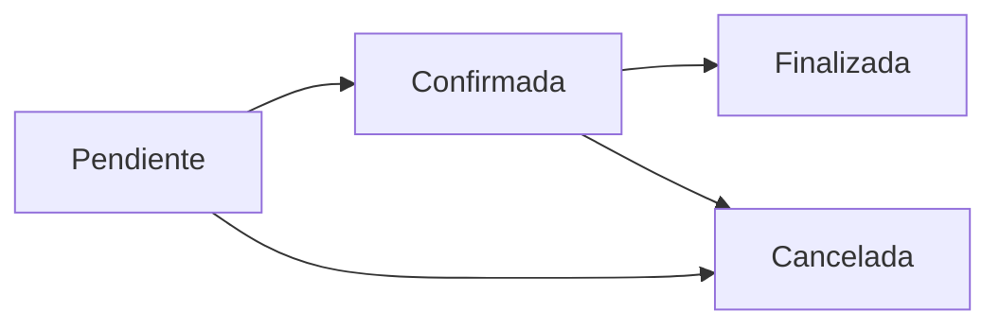

Manage hotel reservations including creation, updates, room and service assignments, and state transitions.

## Reservation Object

The reservation object represents a hotel booking with associated rooms and additional services.

### Attributes

<ResponseField name="reservaId" type="number">
  Unique identifier for the reservation
</ResponseField>

<ResponseField name="clienteId" type="number">
  ID of the client who made the reservation
</ResponseField>

<ResponseField name="estadoReserva" type="string">
  Current state: `Pendiente`, `Confirmada`, `Cancelada`, `Finalizada`
</ResponseField>

<ResponseField name="fechaReserva" type="string">
  Date and time when the reservation was created (UTC)
</ResponseField>

<ResponseField name="fechaEntrada" type="string">
  Check-in date
</ResponseField>

<ResponseField name="fechaSalida" type="string">
  Check-out date
</ResponseField>

<ResponseField name="costoTotal" type="number">
  Total cost including rooms and additional services
</ResponseField>

<ResponseField name="habitaciones" type="array">
  List of reserved rooms
  <ResponseField name="habitacionId" type="number">
    Room ID
  </ResponseField>
  <ResponseField name="tarifaAplicada" type="number">
    Applied rate for this room
  </ResponseField>
</ResponseField>

<ResponseField name="servicios" type="array">
  List of additional services
  <ResponseField name="servicioAdicionalId" type="number">
    Service ID
  </ResponseField>
  <ResponseField name="cantidad" type="number">
    Quantity
  </ResponseField>
  <ResponseField name="precioUnitario" type="number">
    Unit price
  </ResponseField>
  <ResponseField name="subTotal" type="number">
    Subtotal (cantidad * precioUnitario)
  </ResponseField>
</ResponseField>

## Reservation States

Reservations follow a specific lifecycle:



- **Pendiente**: Initial state, can be modified or cancelled
- **Confirmada**: Confirmed by staff, cannot be modified
- **Cancelada**: Cancelled, no further actions possible
- **Finalizada**: Completed after check-out

## List Reservations

Retrieve a paginated list of reservations with filtering options.

### Endpoint

```http
GET /api/reservas
```

### Query Parameters

<ParamField query="pageNumber" type="number" default="1">
  Page number for pagination
</ParamField>

<ParamField query="pageSize" type="number" default="20">
  Number of items per page (max 100)
</ParamField>

<ParamField query="clienteId" type="number">
  Filter by client ID
</ParamField>

<ParamField query="estadoReserva" type="string">
  Filter by state: `Pendiente`, `Confirmada`, `Cancelada`, `Finalizada`
</ParamField>

<ParamField query="fechaDesde" type="string">
  Filter reservations from this date (ISO 8601)
</ParamField>

<ParamField query="fechaHasta" type="string">
  Filter reservations until this date (ISO 8601)
</ParamField>

### Request Example

<CodeGroup>
```bash cURL
curl -X GET "https://api.sgrh.com/api/reservas?estadoReserva=Pendiente&pageNumber=1&pageSize=20" \
  -H "Authorization: Bearer {token}"
```

```csharp C#
var query = "?estadoReserva=Pendiente&pageNumber=1&pageSize=20";
var response = await client.GetAsync(
    $"https://api.sgrh.com/api/reservas{query}"
);
```
</CodeGroup>

### Response

```json
{
  "success": true,
  "data": {
    "items": [
      {
        "reservaId": 1,
        "clienteId": 1,
        "nombreCliente": "Juan Garcia",
        "estadoReserva": "Pendiente",
        "fechaReserva": "2024-03-10T10:00:00Z",
        "fechaEntrada": "2024-03-20",
        "fechaSalida": "2024-03-25",
        "costoTotal": 1500.00,
        "cantidadHabitaciones": 2
      }
    ],
    "pageNumber": 1,
    "pageSize": 20,
    "totalPages": 1,
    "totalCount": 1
  }
}
```

## Get Reservation by ID

Retrieve detailed information about a specific reservation.

### Endpoint

```http
GET /api/reservas/{id}
```

### Path Parameters

<ParamField path="id" type="number" required>
  The unique identifier of the reservation
</ParamField>

### Request Example

<CodeGroup>
```bash cURL
curl -X GET https://api.sgrh.com/api/reservas/1 \
  -H "Authorization: Bearer {token}"
```

```csharp C#
var response = await client.GetAsync(
    $"https://api.sgrh.com/api/reservas/{reservaId}"
);
```
</CodeGroup>

### Response

```json
{
  "success": true,
  "data": {
    "reservaId": 1,
    "clienteId": 1,
    "cliente": {
      "nombreCompleto": "Juan Garcia",
      "email": "juan.garcia@email.com",
      "telefono": "+1-809-555-1234"
    },
    "estadoReserva": "Pendiente",
    "fechaReserva": "2024-03-10T10:00:00Z",
    "fechaEntrada": "2024-03-20",
    "fechaSalida": "2024-03-25",
    "habitaciones": [
      {
        "habitacionId": 101,
        "numeroHabitacion": 101,
        "categoria": "Suite",
        "tarifaAplicada": 250.00
      },
      {
        "habitacionId": 102,
        "numeroHabitacion": 102,
        "categoria": "Doble",
        "tarifaAplicada": 150.00
      }
    ],
    "servicios": [
      {
        "servicioAdicionalId": 1,
        "nombreServicio": "Desayuno",
        "cantidad": 10,
        "precioUnitario": 15.00,
        "subTotal": 150.00
      }
    ],
    "costoTotal": 2150.00
  }
}
```

## Create Reservation

Create a new reservation for a client.

### Endpoint

```http
POST /api/reservas
```

### Request Body

<ParamField body="clienteId" type="number" required>
  ID of the client making the reservation
</ParamField>

<ParamField body="fechaEntrada" type="string" required>
  Check-in date (ISO 8601 format: YYYY-MM-DD)
</ParamField>

<ParamField body="fechaSalida" type="string" required>
  Check-out date (must be after check-in date)
</ParamField>

<ParamField body="habitacionIds" type="array">
  Array of room IDs to reserve (optional, can be added later)
</ParamField>

<ParamField body="servicios" type="array">
  Array of additional services (optional)
  <ParamField body="servicioAdicionalId" type="number" required>
    Service ID
  </ParamField>
  <ParamField body="cantidad" type="number" required>
    Quantity
  </ParamField>
</ParamField>

### Request Example

<CodeGroup>
```bash cURL
curl -X POST https://api.sgrh.com/api/reservas \
  -H "Authorization: Bearer {token}" \
  -H "Content-Type: application/json" \
  -d '{
    "clienteId": 1,
    "fechaEntrada": "2024-04-15",
    "fechaSalida": "2024-04-20",
    "habitacionIds": [101, 102],
    "servicios": [
      {
        "servicioAdicionalId": 1,
        "cantidad": 10
      }
    ]
  }'
```

```csharp C#
var nuevaReserva = new
{
    ClienteId = 1,
    FechaEntrada = "2024-04-15",
    FechaSalida = "2024-04-20",
    HabitacionIds = new[] { 101, 102 },
    Servicios = new[]
    {
        new { ServicioAdicionalId = 1, Cantidad = 10 }
    }
};

var content = new StringContent(
    JsonSerializer.Serialize(nuevaReserva),
    Encoding.UTF8,
    "application/json"
);

var response = await client.PostAsync(
    "https://api.sgrh.com/api/reservas",
    content
);
```
</CodeGroup>

### Response

```json
{
  "success": true,
  "data": {
    "reservaId": 2,
    "clienteId": 1,
    "estadoReserva": "Pendiente",
    "fechaReserva": "2024-03-15T14:30:00Z",
    "fechaEntrada": "2024-04-15",
    "fechaSalida": "2024-04-20",
    "costoTotal": 2150.00
  },
  "message": "Reserva creada exitosamente"
}
```

## Update Reservation

Update dates or modify rooms/services of a pending reservation.

### Endpoint

```http
PUT /api/reservas/{id}
```

### Path Parameters

<ParamField path="id" type="number" required>
  The unique identifier of the reservation to update
</ParamField>

### Request Body

<ParamField body="fechaEntrada" type="string">
  New check-in date
</ParamField>

<ParamField body="fechaSalida" type="string">
  New check-out date
</ParamField>

<Warning>
Only reservations in `Pendiente` state can be updated. Confirmed reservations cannot be modified.
</Warning>

### Request Example

<CodeGroup>
```bash cURL
curl -X PUT https://api.sgrh.com/api/reservas/2 \
  -H "Authorization: Bearer {token}" \
  -H "Content-Type: application/json" \
  -d '{
    "fechaEntrada": "2024-04-16",
    "fechaSalida": "2024-04-21"
  }'
```

```csharp C#
var actualizarReserva = new
{
    FechaEntrada = "2024-04-16",
    FechaSalida = "2024-04-21"
};

var content = new StringContent(
    JsonSerializer.Serialize(actualizarReserva),
    Encoding.UTF8,
    "application/json"
);

var response = await client.PutAsync(
    $"https://api.sgrh.com/api/reservas/{reservaId}",
    content
);
```
</CodeGroup>

## Confirm Reservation

Confirm a pending reservation.

### Endpoint

```http
POST /api/reservas/{id}/confirmar
```

### Path Parameters

<ParamField path="id" type="number" required>
  The unique identifier of the reservation to confirm
</ParamField>

### Request Example

<CodeGroup>
```bash cURL
curl -X POST https://api.sgrh.com/api/reservas/2/confirmar \
  -H "Authorization: Bearer {token}"
```

```csharp C#
var response = await client.PostAsync(
    $"https://api.sgrh.com/api/reservas/{reservaId}/confirmar",
    null
);
```
</CodeGroup>

### Response

```json
{
  "success": true,
  "message": "Reserva confirmada exitosamente"
}
```

## Cancel Reservation

Cancel a reservation.

### Endpoint

```http
POST /api/reservas/{id}/cancelar
```

### Path Parameters

<ParamField path="id" type="number" required>
  The unique identifier of the reservation to cancel
</ParamField>

### Request Body

<ParamField body="motivo" type="string">
  Reason for cancellation (optional, max 500 characters)
</ParamField>

### Request Example

<CodeGroup>
```bash cURL
curl -X POST https://api.sgrh.com/api/reservas/2/cancelar \
  -H "Authorization: Bearer {token}" \
  -H "Content-Type: application/json" \
  -d '{
    "motivo": "Cliente cancelo por cambio de planes"
  }'
```

```csharp C#
var cancelRequest = new { Motivo = "Cliente cancelo por cambio de planes" };
var content = new StringContent(
    JsonSerializer.Serialize(cancelRequest),
    Encoding.UTF8,
    "application/json"
);

var response = await client.PostAsync(
    $"https://api.sgrh.com/api/reservas/{reservaId}/cancelar",
    content
);
```
</CodeGroup>

## Check-In

Perform check-in for a confirmed reservation.

### Endpoint

```http
POST /api/reservas/{id}/checkin
```

### Path Parameters

<ParamField path="id" type="number" required>
  The unique identifier of the reservation
</ParamField>

### Request Body

<ParamField body="fechaHoraCheckIn" type="string">
  Check-in timestamp (defaults to current time if not provided)
</ParamField>

### Request Example

<CodeGroup>
```bash cURL
curl -X POST https://api.sgrh.com/api/reservas/2/checkin \
  -H "Authorization: Bearer {token}" \
  -H "Content-Type: application/json" \
  -d '{
    "fechaHoraCheckIn": "2024-04-15T15:00:00Z"
  }'
```

```csharp C#
var checkInRequest = new 
{ 
    FechaHoraCheckIn = DateTime.UtcNow 
};

var content = new StringContent(
    JsonSerializer.Serialize(checkInRequest),
    Encoding.UTF8,
    "application/json"
);

var response = await client.PostAsync(
    $"https://api.sgrh.com/api/reservas/{reservaId}/checkin",
    content
);
```
</CodeGroup>

## Check-Out

Perform check-out and finalize a reservation.

### Endpoint

```http
POST /api/reservas/{id}/checkout
```

### Path Parameters

<ParamField path="id" type="number" required>
  The unique identifier of the reservation
</ParamField>

### Request Body

<ParamField body="fechaHoraCheckOut" type="string">
  Check-out timestamp (defaults to current time if not provided)
</ParamField>

### Request Example

<CodeGroup>
```bash cURL
curl -X POST https://api.sgrh.com/api/reservas/2/checkout \
  -H "Authorization: Bearer {token}" \
  -H "Content-Type: application/json" \
  -d '{
    "fechaHoraCheckOut": "2024-04-20T11:00:00Z"
  }'
```

```csharp C#
var checkOutRequest = new 
{ 
    FechaHoraCheckOut = DateTime.UtcNow 
};

var content = new StringContent(
    JsonSerializer.Serialize(checkOutRequest),
    Encoding.UTF8,
    "application/json"
);

var response = await client.PostAsync(
    $"https://api.sgrh.com/api/reservas/{reservaId}/checkout",
    content
);
```
</CodeGroup>

## Add Room to Reservation

Add a room to an existing reservation.

### Endpoint

```http
POST /api/reservas/{id}/habitaciones
```

### Path Parameters

<ParamField path="id" type="number" required>
  The unique identifier of the reservation
</ParamField>

### Request Body

<ParamField body="habitacionId" type="number" required>
  ID of the room to add
</ParamField>

### Request Example

<CodeGroup>
```bash cURL
curl -X POST https://api.sgrh.com/api/reservas/2/habitaciones \
  -H "Authorization: Bearer {token}" \
  -H "Content-Type: application/json" \
  -d '{
    "habitacionId": 103
  }'
```

```csharp C#
var addRoomRequest = new { HabitacionId = 103 };

var content = new StringContent(
    JsonSerializer.Serialize(addRoomRequest),
    Encoding.UTF8,
    "application/json"
);

var response = await client.PostAsync(
    $"https://api.sgrh.com/api/reservas/{reservaId}/habitaciones",
    content
);
```
</CodeGroup>

## Remove Room from Reservation

Remove a room from an existing reservation.

### Endpoint

```http
DELETE /api/reservas/{id}/habitaciones/{habitacionId}
```

### Path Parameters

<ParamField path="id" type="number" required>
  The unique identifier of the reservation
</ParamField>

<ParamField path="habitacionId" type="number" required>
  The ID of the room to remove
</ParamField>

### Request Example

<CodeGroup>
```bash cURL
curl -X DELETE https://api.sgrh.com/api/reservas/2/habitaciones/103 \
  -H "Authorization: Bearer {token}"
```

```csharp C#
var response = await client.DeleteAsync(
    $"https://api.sgrh.com/api/reservas/{reservaId}/habitaciones/{habitacionId}"
);
```
</CodeGroup>

## Add Service to Reservation

Add an additional service to a reservation.

### Endpoint

```http
POST /api/reservas/{id}/servicios
```

### Path Parameters

<ParamField path="id" type="number" required>
  The unique identifier of the reservation
</ParamField>

### Request Body

<ParamField body="servicioAdicionalId" type="number" required>
  ID of the service to add
</ParamField>

<ParamField body="cantidad" type="number" required>
  Quantity (must be greater than 0)
</ParamField>

### Request Example

<CodeGroup>
```bash cURL
curl -X POST https://api.sgrh.com/api/reservas/2/servicios \
  -H "Authorization: Bearer {token}" \
  -H "Content-Type: application/json" \
  -d '{
    "servicioAdicionalId": 2,
    "cantidad": 5
  }'
```

```csharp C#
var addServiceRequest = new 
{ 
    ServicioAdicionalId = 2, 
    Cantidad = 5 
};

var content = new StringContent(
    JsonSerializer.Serialize(addServiceRequest),
    Encoding.UTF8,
    "application/json"
);

var response = await client.PostAsync(
    $"https://api.sgrh.com/api/reservas/{reservaId}/servicios",
    content
);
```
</CodeGroup>

## Error Responses

### Room Not Available

```json
{
  "success": false,
  "errors": [
    {
      "code": "ROOM_NOT_AVAILABLE",
      "message": "La habitación 101 no está disponible para las fechas seleccionadas"
    }
  ],
  "message": "Business rule violation"
}
```

### Cannot Modify Confirmed Reservation

```json
{
  "success": false,
  "errors": [
    {
      "code": "RESERVATION_CONFIRMED",
      "message": "Una reserva confirmada no puede ser modificada"
    }
  ],
  "message": "Business rule violation"
}
```

### Must Add Rooms Before Services

```json
{
  "success": false,
  "errors": [
    {
      "code": "NO_ROOMS_IN_RESERVATION",
      "message": "Debe agregar al menos una habitación antes de agregar servicios"
    }
  ],
  "message": "Business rule violation"
}
```
