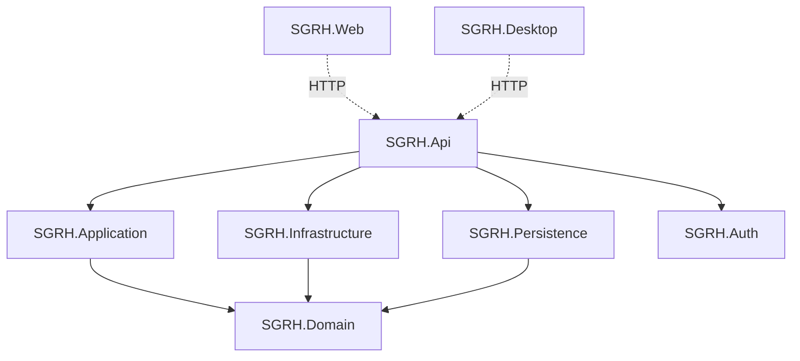

# System Architecture

SGRH follows a **layered architecture** (modular monolith) pattern with strict separation of concerns and dependency inversion. The system is built as a centralized backend exposing a REST API, consumed by decoupled Web and Desktop clients.

## Architecture Overview

### Architecture Type

- **Modular Monolith** - Single deployable unit with clear module boundaries
- **Layered Architecture** - Strict layer separation with dependency rules
- **Centralized Backend** - Single REST API serving multiple clients
- **Decoupled Clients** - Web and Desktop applications consuming the API
- **Contract-Based Infrastructure** - Infrastructure implements domain contracts

## Solution Structure

The SGRH solution consists of 7 main projects:

```text
SGRH
├── SGRH.Domain          # Core business logic and entities
├── SGRH.Application     # Use cases and application logic
├── SGRH.Infrastructure  # External integrations (AWS S3, SES)
├── SGRH.Persistence     # Database access with EF Core
├── SGRH.Auth            # Authentication and authorization
├── SGRH.Api             # REST API endpoints
├── SGRH.Web             # Blazor web client
└── SGRH.Desktop         # .NET MAUI desktop client
```

## Layer Details

### 1. Domain Layer (SGRH.Domain)

The **core of the business** - contains all business logic, entities, and contracts.

<Card title="Key Characteristics" icon="shield-halved">
  - **Zero external dependencies** - Does not depend on any other project
  - **Rich domain models** - Entities with encapsulated business logic
  - **Contract definitions** - Interfaces for infrastructure implementations
  - **Business rules** - Invariants and validation logic
</Card>

**Structure:**

```text
SGRH.Domain/
├── Entities/
│   ├── Clientes/
│   │   └── Cliente.cs
│   ├── Reservas/
│   │   ├── Reserva.cs
│   │   ├── DetalleReserva.cs
│   │   └── ReservaServicioAdicional.cs
│   ├── Habitaciones/
│   │   ├── Habitacion.cs
│   │   ├── HabitacionHistorial.cs
│   │   └── CategoriaHabitacion.cs
│   └── Auditoria/
│       ├── AuditoriaEvento.cs
│       └── AuditoriaEventoDetalle.cs
├── Abstractions/
│   ├── Repositories/
│   │   ├── IAuditoriaRepository.cs
│   │   └── ...
│   ├── Email/
│   │   ├── IEmailSender.cs
│   │   └── IAdminNotifier.cs
│   └── Policies/
│       └── IReservaDomainPolicy.cs
├── Base/
│   └── EntityBase.cs
├── Common/
│   └── Guard.cs
├── Enums/
├── Exceptions/
└── Contracts/
```

**Example: Customer Entity**

```csharp SGRH.Domain/Entities/Clientes/Cliente.cs
public sealed class Cliente : EntityBase
{
    public int ClienteId { get; private set; }
    public string NationalId { get; private set; } = default!;
    public string NombreCliente { get; private set; } = default!;
    public string ApellidoCliente { get; private set; } = default!;
    public string Email { get; private set; } = default!;
    public string Telefono { get; private set; } = default!;

    public Cliente(
        string nationalId,
        string nombreCliente,
        string apellidoCliente,
        string email,
        string telefono)
    {
        Guard.AgainstNullOrWhiteSpace(nationalId, nameof(nationalId), 20);
        Guard.AgainstNullOrWhiteSpace(nombreCliente, nameof(nombreCliente), 100);
        Guard.AgainstNullOrWhiteSpace(apellidoCliente, nameof(apellidoCliente), 100);
        Guard.AgainstNullOrWhiteSpace(email, nameof(email), 100);
        Guard.AgainstNullOrWhiteSpace(telefono, nameof(telefono), 20);

        NationalId = nationalId;
        NombreCliente = nombreCliente;
        ApellidoCliente = apellidoCliente;
        Email = email;
        Telefono = telefono;
    }

    public void ActualizarDatos(
        string nombreCliente,
        string apellidoCliente,
        string email,
        string telefono)
    {
        // Validation and update logic
    }
}
```

<Note>
  Notice how the entity validates all inputs and exposes behavior through methods rather than exposing setters. This is a key principle of domain-driven design.
</Note>

### 2. Application Layer (SGRH.Application)

Orchestrates **use cases** and application workflows.

<Card title="Responsibilities" icon="diagram-project">
  - Defines application use cases
  - Orchestrates domain objects
  - Contains DTOs for data transfer
  - Validates application-level concerns
  - **No direct database access**
  - **No external SDK dependencies**
</Card>

**Dependencies:** Only depends on `SGRH.Domain`

**Structure:**

```text
SGRH.Application/
├── UseCases/
│   ├── Clientes/
│   ├── Reservas/
│   ├── Habitaciones/
│   └── Reportes/
├── DTOs/
│   ├── Requests/
│   └── Responses/
└── Validators/
```

### 3. Infrastructure Layer (SGRH.Infrastructure)

Implements **domain contracts** for external services.

<Card title="Implementations" icon="cloud">
  - Amazon S3 integration for file storage
  - Amazon SES integration for email notifications
  - External service adapters
  - Cloud service clients
</Card>

**Dependencies:** `SGRH.Domain`

**Structure:**

```text
SGRH.Infrastructure/
├── StorageS3/
│   └── S3StorageService.cs
├── EmailSES/
│   └── SESEmailService.cs
└── DependencyInjection/
    └── InfrastructureServiceRegistration.cs
```

### 4. Persistence Layer (SGRH.Persistence)

Handles **database access** using Entity Framework Core.

<Card title="Data Access" icon="database">
  - Entity Framework Core 8.0
  - MySQL provider (note: configured for SQL Server in code)
  - Repository implementations
  - Database context configuration
  - Migrations management
</Card>

**Dependencies:** `SGRH.Domain`

**Key Component:**

```csharp SGRH.Persistence/Context/SGRHDbContext.cs
public class SGRHDbContext : DbContext
{
    public SGRHDbContext(DbContextOptions<SGRHDbContext> options)
        : base(options)
    {
    }

    // DbSets for all entities
    public DbSet<Cliente> Clientes { get; set; }
    public DbSet<Reserva> Reservas { get; set; }
    public DbSet<Habitacion> Habitaciones { get; set; }
    // ... more entities
}
```

### 5. Auth Module (SGRH.Auth)

Handles **authentication and authorization**.

<Card title="Security Features" icon="lock">
  - JWT token generation and validation
  - Authorization policies
  - Authentication services
  - Role-based access control
</Card>

**Structure:**

```text
SGRH.Auth/
├── Services/
│   └── TokenService.cs
├── Policies/
└── Extensions/
```

### 6. API Layer (SGRH.Api)

The **entry point** exposing REST endpoints.

<Card title="API Features" icon="server">
  - REST controllers
  - Swagger/OpenAPI documentation
  - Security configuration
  - Dependency injection setup
  - Request/response handling
</Card>

**Dependencies:** `SGRH.Application`, `SGRH.Infrastructure`, `SGRH.Persistence`, `SGRH.Auth`

**Project Configuration:**

```xml SGRH.Api/SGRH.Api.csproj
<Project Sdk="Microsoft.NET.Sdk.Web">
  <PropertyGroup>
    <TargetFramework>net8.0</TargetFramework>
    <Nullable>enable</Nullable>
    <ImplicitUsings>enable</ImplicitUsings>
  </PropertyGroup>

  <ItemGroup>
    <PackageReference Include="Microsoft.AspNetCore.Authentication.JwtBearer" Version="8.0.0" />
    <PackageReference Include="Microsoft.EntityFrameworkCore.Design" Version="8.0.0" />
    <PackageReference Include="Swashbuckle.AspNetCore" Version="8.0.0" />
  </ItemGroup>

  <ItemGroup>
    <ProjectReference Include="..\SGRH.Application\SGRH.Application.csproj" />
    <ProjectReference Include="..\SGRH.Auth\SGRH.Auth.csproj" />
    <ProjectReference Include="..\SGRH.Infrastructure\SGRH.Infrastructure.csproj" />
    <ProjectReference Include="..\SGRH.Persistence\SGRH.Persistence.csproj" />
  </ItemGroup>
</Project>
```

**Controllers:**

```text
SGRH.Api/Controllers/
├── ClientesController.cs
├── ReservasController.cs
├── HabitacionesController.cs
├── ReportesController.cs
└── AuditoriaController.cs
```

**Program.cs Bootstrap:**

```csharp SGRH.Api/Program.cs
var builder = WebApplication.CreateBuilder(args);

// Add services to the container
builder.Services.AddControllers();
builder.Services.AddEndpointsApiExplorer();
builder.Services.AddSwaggerGen();

// Database configuration
builder.Services.AddDbContext<SGRHDbContext>(options =>
    options.UseSqlServer(builder.Configuration.GetConnectionString("Default")));

var app = builder.Build();

// Configure middleware pipeline
if (!app.Environment.IsDevelopment())
{
    app.UseHttpsRedirection();
}

if (app.Environment.IsDevelopment())
{
    app.UseSwagger();
    app.UseSwaggerUI();
}

app.UseAuthorization();
app.MapControllers();

app.Run();
```

### 7. Client Applications

#### Web Client (SGRH.Web)

<Card title="Blazor Server" icon="globe">
  - Server-side Blazor application
  - Consumes REST API via HTTP
  - No business logic - pure presentation
  - Real-time UI updates
</Card>

#### Desktop Client (SGRH.Desktop)

<Card title=".NET MAUI Blazor Hybrid" icon="desktop">
  - Cross-platform desktop application
  - Blazor UI in native container
  - Role-based interfaces (Admin/Receptionist)
  - Consumes REST API via HTTP
  - No business logic - pure presentation
</Card>

## Dependency Flow

The architecture enforces strict dependency rules:



<Warning>
  **Critical Rule:** The Domain layer has **zero dependencies**. All other layers depend on the domain, never the reverse. This is the essence of dependency inversion.
</Warning>

## Key Architectural Patterns

### Dependency Inversion

The domain defines interfaces, infrastructure implements them:

```csharp SGRH.Domain/Abstractions/Email/IEmailSender.cs
public interface IEmailSender
{
    Task<EmailSendResult> SendEmailAsync(EmailMessage message);
}
```

```csharp SGRH.Infrastructure/EmailSES/SESEmailService.cs
public class SESEmailService : IEmailSender
{
    public async Task<EmailSendResult> SendEmailAsync(EmailMessage message)
    {
        // AWS SES implementation
    }
}
```

### Domain Policies

Complex business rules are encapsulated in policy objects:

```csharp SGRH.Domain/Abstractions/Policies/IReservaDomainPolicy.cs
public interface IReservaDomainPolicy
{
    void EnsureHabitacionDisponible(int habitacionId, DateTime entrada, 
        DateTime salida, int? excludeReservaId);
    
    void EnsureHabitacionNoEnMantenimiento(int habitacionId, 
        DateTime entrada, DateTime salida);
    
    decimal GetTarifaAplicada(int habitacionId, DateTime fechaEntrada);
    
    int GetTemporadaId(DateTime fecha);
}
```

Policies are injected into domain entities to enforce complex rules:

```csharp SGRH.Domain/Entities/Reservas/Reserva.cs
public void AgregarHabitacion(int habitacionId, IReservaDomainPolicy policy)
{
    Guard.AgainstNull(policy, nameof(policy));
    EnsureEditable();
    
    policy.EnsureHabitacionDisponible(
        habitacionId, FechaEntrada, FechaSalida,
        ReservaId == 0 ? null : ReservaId);
    
    policy.EnsureHabitacionNoEnMantenimiento(
        habitacionId, FechaEntrada, FechaSalida);
    
    var tarifa = policy.GetTarifaAplicada(habitacionId, FechaEntrada);
    
    _habitaciones.Add(new DetalleReserva(ReservaId, habitacionId, tarifa));
}
```

## Benefits of This Architecture

<CardGroup cols={2}>
  <Card title="Testability" icon="vial">
    Each layer can be tested in isolation with mocked dependencies
  </Card>
  
  <Card title="Maintainability" icon="wrench">
    Clear boundaries make changes predictable and contained
  </Card>
  
  <Card title="Flexibility" icon="shuffle">
    Easy to swap implementations (e.g., change from SQL Server to MySQL)
  </Card>
  
  <Card title="Domain Focus" icon="bullseye">
    Business logic is isolated and independent of technical concerns
  </Card>
</CardGroup>

## Next Steps

<CardGroup cols={2}>
  <Card title="Quick Start" icon="rocket" href="/quickstart">
    Set up and run SGRH on your local machine
  </Card>
  
  <Card title="API Reference" icon="code" href="/api/introduction">
    Explore the REST API endpoints
  </Card>
</CardGroup>