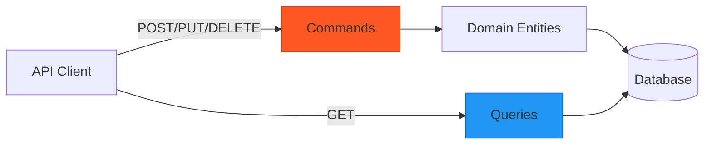

# Application Layer

<Note>
**Implementation Status**: The Application layer has a complete CQRS folder structure with Command and Query files, but these are currently stub classes. The structure is ready for implementation.
</Note>

The Application layer will orchestrate business workflows using the **CQRS** (Command Query Responsibility Segregation) pattern. It will contain use cases that coordinate domain entities, repositories, and external services.

## CQRS Pattern

SGRH separates **write operations** (Commands) from **read operations** (Queries):

<CardGroup cols={2}>
  <Card title="Commands" icon="pen-to-square">
    Modify state, enforce business rules, and coordinate domain entities
  </Card>
  <Card title="Queries" icon="magnifying-glass">
    Read data optimized for specific UI needs without loading full aggregates
  </Card>
</CardGroup>



## Project Structure

```
SGRH.Application/
├── Features/
│   ├── Reservas/
│   │   ├── Commands/
│   │   │   ├── CrearReserva.cs
│   │   │   ├── ActualizarReserva.cs
│   │   │   ├── ConfirmarReserva.cs
│   │   │   ├── CancelarReserva.cs
│   │   │   ├── CheckIn.cs
│   │   │   └── CheckOut.cs
│   │   └── Queries/
│   │       ├── ListarReservas.cs
│   │       └── ObtenerReservaPorId.cs
│   ├── Habitaciones/
│   │   ├── Commands/
│   │   │   ├── CrearHabitacion.cs
│   │   │   ├── ActualizarHabitacion.cs
│   │   │   └── CambiarEstadoHabitacion.cs
│   │   └── Queries/
│   │       ├── ListarHabitaciones.cs
│   │       └── ObtenerHabitacionPorId.cs
│   ├── Clientes/
│   │   ├── Commands/
│   │   │   ├── CrearCliente.cs
│   │   │   ├── ActualizarCliente.cs
│   │   │   └── EliminarCliente.cs
│   │   └── Queries/
│   │       ├── ListarClientes.cs
│   │       └── ObtenerClientePorId.cs
│   ├── ServiciosAdicionales/
│   ├── TarifasTemporadas/
│   ├── Reportes/
│   └── Auditoria/
├── Common/
│   ├── Mappings/              # Entity to DTO mappings
│   └── Exceptions/            # Application-level exceptions
└── DependencyInjection.cs
```

## Command Pattern

### Command Structure

Commands are represented as classes with specific responsibilities:

```csharp
// Typical command structure (conceptual - actual files may vary)
public class CrearReservaCommand
{
    public int ClienteId { get; set; }
    public DateTime FechaEntrada { get; set; }
    public DateTime FechaSalida { get; set; }
    public List<int> HabitacionIds { get; set; }
}

public class CrearReservaHandler
{
    private readonly IReservaRepository _reservaRepo;
    private readonly IReservaDomainPolicy _policy;
    private readonly IUnitOfWork _uow;

    public async Task<ReservaDto> Handle(CrearReservaCommand cmd, CancellationToken ct)
    {
        // 1. Create domain entity
        var reserva = new Reserva(cmd.ClienteId, cmd.FechaEntrada, cmd.FechaSalida);

        // 2. Add rooms through domain methods
        foreach (var habitacionId in cmd.HabitacionIds)
        {
            reserva.AgregarHabitacion(habitacionId, _policy);
        }

        // 3. Persist
        await _reservaRepo.AddAsync(reserva, ct);
        await _uow.SaveChangesAsync(ct);

        // 4. Return DTO
        return MapToDto(reserva);
    }
}
```

<Note>
  Commands **orchestrate** domain entities but don't contain business logic themselves. Logic stays in the Domain layer.
</Note>

### Command Examples by Feature

<Tabs>
  <Tab title="Reservations">
    <AccordionGroup>
      <Accordion title="CrearReserva">
        Creates a new reservation with initial room assignments.
        
        **Flow:**
        1. Validate client exists
        2. Create `Reserva` domain entity (state: Pendiente)
        3. Add rooms through `AgregarHabitacion()` method
        4. Policy validates room availability and pricing
        5. Persist and return DTO
      </Accordion>
      
      <Accordion title="ConfirmarReserva">
        Transitions reservation from Pendiente → Confirmada.
        
        **Flow:**
        1. Load reservation with details
        2. Call `reserva.Confirmar()` domain method
        3. Domain enforces business rules (must have rooms)
        4. Save changes
      </Accordion>
      
      <Accordion title="CheckIn / CheckOut">
        Handles guest arrival and departure.
        
        **Flow (CheckIn):**
        1. Load confirmed reservation
        2. Validate dates match current date
        3. Change room states to Ocupada
        4. Update reservation state if needed
        5. Generate audit log
      </Accordion>
      
      <Accordion title="CancelarReserva">
        Cancels an existing reservation.
        
        **Flow:**
        1. Load reservation
        2. Call `reserva.Cancelar()` domain method
        3. Domain prevents canceling finalized reservations
        4. Release room allocations
        5. Save and notify client (via email service)
      </Accordion>
    </AccordionGroup>
  </Tab>
  
  <Tab title="Rooms">
    <AccordionGroup>
      <Accordion title="CrearHabitacion">
        Registers a new room in the system.
        
        **Flow:**
        1. Validate category exists
        2. Check room number uniqueness
        3. Create `Habitacion` entity (initial state: Disponible)
        4. Persist
      </Accordion>
      
      <Accordion title="CambiarEstadoHabitacion">
        Changes room status (Disponible, Mantenimiento, etc.).
        
        **Flow:**
        1. Load room entity
        2. Call `habitacion.CambiarEstado()` method
        3. Domain creates temporal history record
        4. Validates state transition rules
        5. Save changes
      </Accordion>
    </AccordionGroup>
  </Tab>
  
  <Tab title="Clients">
    <AccordionGroup>
      <Accordion title="CrearCliente">
        Registers a new customer.
        
        **Flow:**
        1. Validate NationalId uniqueness
        2. Create `Cliente` entity
        3. Guard clauses validate email format, phone, etc.
        4. Persist
      </Accordion>
      
      <Accordion title="ActualizarCliente">
        Updates customer information.
        
        **Flow:**
        1. Load client entity
        2. Call `cliente.ActualizarDatos()` method
        3. Domain validates new data
        4. Save changes
      </Accordion>
    </AccordionGroup>
  </Tab>
  
  <Tab title="Services & Rates">
    <AccordionGroup>
      <Accordion title="CrearTarifa">
        Creates pricing for a room category in a season.
        
        **Flow:**
        1. Validate category and season exist
        2. Check for overlapping rates
        3. Create `TarifaTemporada` entity
        4. Persist
      </Accordion>
      
      <Accordion title="CrearServicioAdicional">
        Adds a new hotel service (Spa, Restaurant, etc.).
        
        **Flow:**
        1. Create `ServicioAdicional` entity
        2. Optionally enable for specific seasons
        3. Set pricing by room category
        4. Persist
      </Accordion>
    </AccordionGroup>
  </Tab>
</Tabs>

## Query Pattern

### Query Structure

Queries bypass domain entities for optimized reads:

```csharp
// Conceptual query structure
public class ListarReservasQuery
{
    public DateTime? FechaDesde { get; set; }
    public DateTime? FechaHasta { get; set; }
    public EstadoReserva? Estado { get; set; }
    public int PageNumber { get; set; } = 1;
    public int PageSize { get; set; } = 20;
}

public class ListarReservasHandler
{
    private readonly SGRHDbContext _db;

    public async Task<PagedResult<ReservaListDto>> Handle(
        ListarReservasQuery query, CancellationToken ct)
    {
        var queryable = _db.Reservas
            .Include(r => r.Habitaciones)
            .AsQueryable();

        // Apply filters
        if (query.FechaDesde.HasValue)
            queryable = queryable.Where(r => r.FechaEntrada >= query.FechaDesde);

        if (query.Estado.HasValue)
            queryable = queryable.Where(r => r.EstadoReserva == query.Estado);

        // Project to DTO and paginate
        var total = await queryable.CountAsync(ct);
        var items = await queryable
            .OrderByDescending(r => r.FechaReserva)
            .Skip((query.PageNumber - 1) * query.PageSize)
            .Take(query.PageSize)
            .Select(r => new ReservaListDto
            {
                ReservaId = r.ReservaId,
                ClienteId = r.ClienteId,
                FechaEntrada = r.FechaEntrada,
                FechaSalida = r.FechaSalida,
                EstadoReserva = r.EstadoReserva.ToString(),
                CostoTotal = r.CostoTotal,
                NumeroHabitaciones = r.Habitaciones.Count
            })
            .ToListAsync(ct);

        return new PagedResult<ReservaListDto>(items, total, query.PageNumber, query.PageSize);
    }
}
```

<Tip>
  Queries use **direct EF Core projections** to DTOs for performance. No need to load full entity graphs.
</Tip>

### Query Examples

<Tabs>
  <Tab title="Reservations">
    - **ListarReservas**: Paginated list with filters (date range, status, client)
    - **ObtenerReservaPorId**: Full reservation details including rooms and services
  </Tab>
  <Tab title="Rooms">
    - **ListarHabitaciones**: Available rooms by date range and category
    - **ObtenerHabitacionPorId**: Room details with current status
  </Tab>
  <Tab title="Reports">
    - **GenerarReporteOcupacion**: Room occupancy statistics by period
    - **GenerarReporteIngresos**: Revenue reports with breakdowns
    - **GenerarReporteReservas**: Reservation analytics and trends
  </Tab>
  <Tab title="Audit">
    - **ObtenerAuditoria**: Query audit logs by entity, action, user, and date range
  </Tab>
</Tabs>

## Mapping Strategies

The application layer uses mapping extensions to convert entities to DTOs:

```
SGRH.Application/Common/Mappings/
├── Clientes/
│   └── ClienteMap.cs
├── Habitaciones/
│   └── HabitacionMap.cs
├── Reservas/
│   ├── ReservaMap.cs
│   └── ReservaDetalleMap.cs
├── ServiciosAdicionales/
│   └── ServicioAdicionalMap.cs
└── TarifasTemporadas/
    ├── TarifaMap.cs
    └── TemporadaMap.cs
```

<CodeGroup>
```csharp Manual Mapping
public static class ReservaMap
{
    public static ReservaDto ToDto(this Reserva reserva)
    {
        return new ReservaDto
        {
            ReservaId = reserva.ReservaId,
            ClienteId = reserva.ClienteId,
            EstadoReserva = reserva.EstadoReserva.ToString(),
            FechaReserva = reserva.FechaReserva,
            FechaEntrada = reserva.FechaEntrada,
            FechaSalida = reserva.FechaSalida,
            CostoTotal = reserva.CostoTotal,
            Habitaciones = reserva.Habitaciones.Select(h => h.ToDto()).ToList(),
            Servicios = reserva.Servicios.Select(s => s.ToDto()).ToList()
        };
    }
}
```

```csharp EF Projection
// Direct projection in queries for performance
var dto = await _db.Reservas
    .Where(r => r.ReservaId == id)
    .Select(r => new ReservaDto
    {
        ReservaId = r.ReservaId,
        ClienteId = r.ClienteId,
        // ...
    })
    .FirstOrDefaultAsync(ct);
```
</CodeGroup>

## Exception Handling

Application-level exceptions wrap domain exceptions:

```csharp
SGRH.Application/Common/Exceptions/
├── ValidationException.cs      # Input validation failures
├── NotFoundException.cs        # Entity not found
└── ForbiddenException.cs      # Authorization failures
```

## Unit of Work Pattern

Commands coordinate multiple repository operations within a transaction:

```csharp
public interface IUnitOfWork
{
    Task<int> SaveChangesAsync(CancellationToken ct = default);
    Task BeginTransactionAsync(CancellationToken ct = default);
    Task CommitAsync(CancellationToken ct = default);
    Task RollbackAsync(CancellationToken ct = default);
}

// Usage in command handler
public async Task Handle(CrearReservaCommand cmd, CancellationToken ct)
{
    await _uow.BeginTransactionAsync(ct);
    try
    {
        // Multiple operations
        await _reservaRepo.AddAsync(reserva, ct);
        await _auditoriaRepo.AddAsync(audit, ct);
        
        await _uow.CommitAsync(ct);
    }
    catch
    {
        await _uow.RollbackAsync(ct);
        throw;
    }
}
```

## Feature Organization

<CardGroup cols={2}>
  <Card title="Reservas" icon="calendar-check">
    - Crear, Actualizar, Confirmar, Cancelar
    - CheckIn / CheckOut workflows
    - Service and room management
  </Card>
  <Card title="Habitaciones" icon="bed">
    - CRUD operations
    - State changes with history tracking
    - Availability queries
  </Card>
  <Card title="Clientes" icon="users">
    - Customer registration and updates
    - Reservation history queries
  </Card>
  <Card title="Servicios Adicionales" icon="concierge-bell">
    - Service catalog management
    - Seasonal availability configuration
    - Category-based pricing
  </Card>
  <Card title="Tarifas y Temporadas" icon="tags">
    - Dynamic pricing by season
    - Room category rate management
  </Card>
  <Card title="Reportes" icon="chart-line">
    - Occupancy reports
    - Revenue analytics
    - Reservation trends
  </Card>
  <Card title="Auditoría" icon="clipboard-list">
    - Event logging
    - Change tracking
    - Compliance reports
  </Card>
  <Card title="Security" icon="lock">
    - Login / RefreshToken
    - User profile queries
  </Card>
</CardGroup>

## Key Design Decisions

<CardGroup cols={2}>
  <Card title="CQRS Separation" icon="code-branch">
    Commands modify state through domain entities; Queries read optimized DTOs
  </Card>
  <Card title="Thin Handlers" icon="feather">
    Application handlers orchestrate but don't contain business logic
  </Card>
  <Card title="DTO Projections" icon="diagram-project">
    Queries project directly to DTOs to avoid loading full aggregates
  </Card>
  <Card title="Domain Policies" icon="gavel">
    Complex rules delegated to policy implementations injected via DI
  </Card>
</CardGroup>

## Related Documentation

<CardGroup cols={3}>
  <Card title="Domain Layer" href="/architecture/domain-layer" icon="cube">
    Understand the entities being orchestrated
  </Card>
  <Card title="API Layer" href="/architecture/api-layer" icon="network-wired">
    See how controllers invoke commands/queries
  </Card>
  <Card title="Infrastructure" href="/architecture/infrastructure-layer" icon="database">
    Learn about persistence and external services
  </Card>
</CardGroup>
