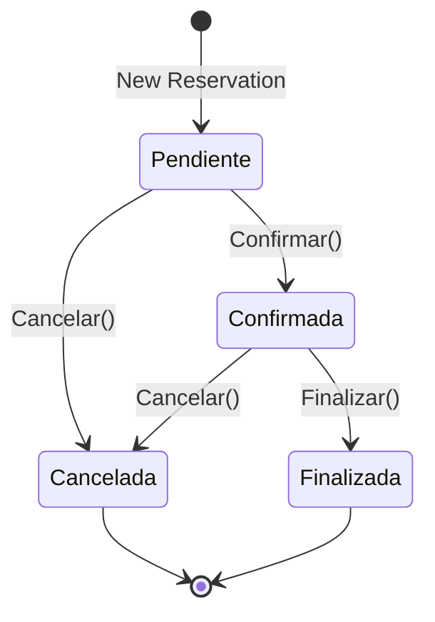

# Domain Layer

The Domain layer is the **heart of the application**, containing all business logic, entities, and domain rules. It has **zero dependencies** on other layers, making it highly testable and portable.

## Project Structure

```
SGRH.Domain/
├── Base/
│   └── EntityBase.cs              # Base class for all entities
├── Entities/
│   ├── Reservas/
│   │   ├── Reserva.cs             # Aggregate root for reservations
│   │   ├── DetalleReserva.cs      # Room details in reservation
│   │   └── ReservaServicioAdicional.cs
│   ├── Habitaciones/
│   │   ├── Habitacion.cs          # Room entity
│   │   ├── CategoriaHabitacion.cs
│   │   ├── HabitacionHistorial.cs # Temporal state tracking
│   │   └── TarifaTemporada.cs
│   ├── Clientes/
│   │   └── Cliente.cs
│   ├── Servicios/
│   │   ├── ServicioAdicional.cs
│   │   └── ServicioCategoriaPrecio.cs
│   ├── Temporadas/
│   │   └── Temporada.cs
│   └── Auditoria/
│       ├── AuditoriaEvento.cs
│       └── AuditoriaEventoDetalle.cs
├── Abstractions/
│   ├── Repositories/              # Repository interfaces
│   └── Policies/                  # Domain policy interfaces
├── Common/
│   └── Guard.cs                   # Validation guards
├── Enums/
│   ├── EstadoReserva.cs
│   └── EstadoHabitacion.cs
└── Exceptions/
    ├── ValidationException.cs
    ├── BusinessRuleViolationException.cs
    ├── NotFoundException.cs
    └── ConflictException.cs
```

## Core Entities

### Reserva (Aggregate Root)

The `Reserva` entity is a rich domain model with encapsulated behavior and state management.

```csharp
public sealed class Reserva : EntityBase
{
    public int ReservaId { get; private set; }
    public int ClienteId { get; private set; }
    public EstadoReserva EstadoReserva { get; private set; }
    public DateTime FechaReserva { get; private set; }
    public DateTime FechaEntrada { get; private set; }
    public DateTime FechaSalida { get; private set; }

    // Calculated property - total cost
    public decimal CostoTotal =>
        _habitaciones.Sum(h => h.TarifaAplicada) +
        _servicios.Sum(s => s.SubTotal);

    private readonly List<DetalleReserva> _habitaciones = [];
    public IReadOnlyCollection<DetalleReserva> Habitaciones => _habitaciones;

    private readonly List<ReservaServicioAdicional> _servicios = [];
    public IReadOnlyCollection<ReservaServicioAdicional> Servicios => _servicios;

    private Reserva() { } // EF Core

    public Reserva(int clienteId, DateTime fechaEntrada, DateTime fechaSalida)
    {
        Guard.AgainstOutOfRange(clienteId, nameof(clienteId), 0);
        Guard.AgainstInvalidDateRange(fechaEntrada, fechaSalida,
                                      nameof(fechaEntrada), nameof(fechaSalida));

        ClienteId = clienteId;
        FechaEntrada = fechaEntrada;
        FechaSalida = fechaSalida;
        EstadoReserva = EstadoReserva.Pendiente;
        FechaReserva = DateTime.UtcNow;
    }
}
```

<Note>
  Notice the **private setters** and **private collections** with public read-only interfaces. This enforces invariants through methods.
</Note>

#### Reservation State Machine

Reservations follow a strict state transition flow:



#### Business Logic Methods

<Tabs>
  <Tab title="Managing Rooms">
    ```csharp
    public void AgregarHabitacion(int habitacionId, IReservaDomainPolicy policy)
    {
        Guard.AgainstNull(policy, nameof(policy));
        EnsureEditable();
        Guard.AgainstOutOfRange(habitacionId, nameof(habitacionId), 0);

        if (_habitaciones.Any(h => h.HabitacionId == habitacionId))
            throw new ConflictException(
                "La habitación ya está incluida en esta reserva.");

        // Policy checks availability and maintenance status
        policy.EnsureHabitacionDisponible(
            habitacionId, FechaEntrada, FechaSalida,
            ReservaId == 0 ? null : ReservaId);

        policy.EnsureHabitacionNoEnMantenimiento(
            habitacionId, FechaEntrada, FechaSalida);

        var tarifa = policy.GetTarifaAplicada(habitacionId, FechaEntrada);

        _habitaciones.Add(new DetalleReserva(ReservaId, habitacionId, tarifa));

        if (_servicios.Count > 0)
            RecalcularSnapshots(policy);
    }

    public void QuitarHabitacion(int habitacionId, IReservaDomainPolicy policy)
    {
        Guard.AgainstNull(policy, nameof(policy));
        EnsureEditable();

        var detalle = _habitaciones.FirstOrDefault(h => h.HabitacionId == habitacionId)
            ?? throw new NotFoundException("DetalleReserva", habitacionId.ToString());

        _habitaciones.Remove(detalle);

        if (_servicios.Count > 0)
            RecalcularSnapshots(policy);
    }
    ```
  </Tab>
  <Tab title="Managing Services">
    ```csharp
    public void AgregarServicio(
        int servicioAdicionalId,
        int cantidad,
        IReservaDomainPolicy policy)
    {
        Guard.AgainstNull(policy, nameof(policy));
        EnsureEditable();
        Guard.AgainstOutOfRange(servicioAdicionalId, nameof(servicioAdicionalId), 0);
        Guard.AgainstOutOfRange(cantidad, nameof(cantidad), 0);

        if (_habitaciones.Count == 0)
            throw new BusinessRuleViolationException(
                "Debe agregar al menos una habitación antes de agregar servicios.");

        if (_servicios.Any(s => s.ServicioAdicionalId == servicioAdicionalId))
            throw new ConflictException(
                "El servicio ya está en la reserva. Modifica la cantidad en su lugar.");

        var temporadaId = policy.GetTemporadaId(FechaEntrada);
        policy.EnsureServicioDisponibleEnTemporada(servicioAdicionalId, temporadaId);

        var precioUnitario = policy.GetPrecioServicioAplicado(
            ReservaId, servicioAdicionalId);

        _servicios.Add(new ReservaServicioAdicional(
            ReservaId, servicioAdicionalId, cantidad, precioUnitario));
    }
    ```
  </Tab>
  <Tab title="State Transitions">
    ```csharp
    public void Confirmar()
    {
        if (EstadoReserva != EstadoReserva.Pendiente)
            throw new BusinessRuleViolationException(
                $"Solo una reserva Pendiente puede confirmarse. Estado actual: {EstadoReserva}.");

        if (_habitaciones.Count == 0)
            throw new BusinessRuleViolationException(
                "No se puede confirmar una reserva sin habitaciones.");

        EstadoReserva = EstadoReserva.Confirmada;
    }

    public void Cancelar()
    {
        if (EstadoReserva == EstadoReserva.Finalizada)
            throw new BusinessRuleViolationException(
                "Una reserva finalizada no puede cancelarse.");

        if (EstadoReserva == EstadoReserva.Cancelada)
            throw new BusinessRuleViolationException(
                "La reserva ya está cancelada.");

        EstadoReserva = EstadoReserva.Cancelada;
    }

    public void Finalizar()
    {
        if (EstadoReserva != EstadoReserva.Confirmada)
            throw new BusinessRuleViolationException(
                "Solo una reserva Confirmada puede finalizarse.");

        EstadoReserva = EstadoReserva.Finalizada;
    }
    ```
  </Tab>
</Tabs>

### Habitacion Entity

Rooms track their state changes over time through a temporal pattern:

```csharp
public sealed class Habitacion : EntityBase
{
    public int HabitacionId { get; private set; }
    public int CategoriaHabitacionId { get; private set; }
    public int NumeroHabitacion { get; private set; }
    public int Piso { get; private set; }

    // Private collection - only modified through CambiarEstado()
    private readonly List<HabitacionHistorial> _historial = [];
    public IReadOnlyCollection<HabitacionHistorial> Historial => _historial;

    // Current state is the record with FechaFin == null
    public HabitacionHistorial? EstadoActual
        => _historial.FirstOrDefault(h => h.FechaFin is null);

    public Habitacion(int categoriaHabitacionId, int numeroHabitacion, int piso)
    {
        Guard.AgainstOutOfRange(categoriaHabitacionId, nameof(categoriaHabitacionId), 0);
        Guard.AgainstOutOfRange(numeroHabitacion, nameof(numeroHabitacion), 0);
        Guard.AgainstOutOfRange(piso, nameof(piso), 0);

        CategoriaHabitacionId = categoriaHabitacionId;
        NumeroHabitacion = numeroHabitacion;
        Piso = piso;

        _historial.Add(new HabitacionHistorial(HabitacionId, EstadoHabitacion.Disponible, null));
    }

    public void CambiarEstado(EstadoHabitacion nuevoEstado, string? motivo = null)
    {
        if (EstadoActual?.EstadoHabitacion == nuevoEstado)
            throw new BusinessRuleViolationException(
                $"La habitación ya se encuentra en estado {nuevoEstado}.");

        // Close current record
        EstadoActual?.Cerrar();

        // Create new active record
        _historial.Add(new HabitacionHistorial(HabitacionId, nuevoEstado, motivo));
    }
}
```

<Tip>
  The temporal pattern allows tracking **when** and **why** room states changed, crucial for audit trails.
</Tip>

### Cliente Entity

```csharp
public sealed class Cliente : EntityBase
{
    public int ClienteId { get; private set; }
    public string NationalId { get; private set; } = default!;
    public string NombreCliente { get; private set; } = default!;
    public string ApellidoCliente { get; private set; } = default!;
    public string Email { get; private set; } = default!;
    public string Telefono { get; private set; } = default!;

    public Cliente(
        string nationalId,
        string nombreCliente,
        string apellidoCliente,
        string email,
        string telefono)
    {
        Guard.AgainstNullOrWhiteSpace(nationalId, nameof(nationalId), 20);
        Guard.AgainstNullOrWhiteSpace(nombreCliente, nameof(nombreCliente), 100);
        Guard.AgainstNullOrWhiteSpace(apellidoCliente, nameof(apellidoCliente), 100);
        Guard.AgainstNullOrWhiteSpace(email, nameof(email), 100);
        Guard.AgainstNullOrWhiteSpace(telefono, nameof(telefono), 20);

        NationalId = nationalId;
        NombreCliente = nombreCliente;
        ApellidoCliente = apellidoCliente;
        Email = email;
        Telefono = telefono;
    }

    public void ActualizarDatos(
        string nombreCliente,
        string apellidoCliente,
        string email,
        string telefono)
    {
        Guard.AgainstNullOrWhiteSpace(nombreCliente, nameof(nombreCliente), 100);
        Guard.AgainstNullOrWhiteSpace(apellidoCliente, nameof(apellidoCliente), 100);
        Guard.AgainstNullOrWhiteSpace(email, nameof(email), 100);
        Guard.AgainstNullOrWhiteSpace(telefono, nameof(telefono), 20);

        NombreCliente = nombreCliente;
        ApellidoCliente = apellidoCliente;
        Email = email;
        Telefono = telefono;
    }
}
```

### ServicioAdicional Entity

```csharp
public sealed class ServicioAdicional : EntityBase
{
    public int ServicioAdicionalId { get; private set; }
    public string NombreServicio { get; private set; } = default!;
    public string TipoServicio { get; private set; } = default!;

    private readonly List<int> _temporadaIds = [];
    public IReadOnlyCollection<int> TemporadaIds => _temporadaIds;

    public void HabilitarEnTemporada(int temporadaId)
    {
        Guard.AgainstOutOfRange(temporadaId, nameof(temporadaId), 0);

        if (_temporadaIds.Contains(temporadaId))
            throw new ConflictException(
                $"El servicio ya está habilitado para la temporada {temporadaId}.");

        _temporadaIds.Add(temporadaId);
    }

    public bool EstaDisponibleEn(int? temporadaId)
    {
        if (temporadaId is null) return true;
        return _temporadaIds.Contains(temporadaId.Value);
    }
}
```

## Domain Policies

Complex cross-aggregate business rules are delegated to policy interfaces:

```csharp
public interface IReservaDomainPolicy
{
    // Get season for entry date (can be null if no season)
    int? GetTemporadaId(DateTime fechaEntrada);

    // Validate room availability for date range and current reservation
    void EnsureHabitacionDisponible(int habitacionId, DateTime fechaEntrada, 
                                     DateTime fechaSalida, int? reservaId);

    // Validate room is NOT in maintenance for date range
    void EnsureHabitacionNoEnMantenimiento(int habitacionId, DateTime fechaEntrada, 
                                           DateTime fechaSalida);

    // Get applicable rate per room for date (season + category)
    decimal GetTarifaAplicada(int habitacionId, DateTime fechaEntrada);

    // Validate service availability for season
    void EnsureServicioDisponibleEnTemporada(int servicioAdicionalId, int? temporadaId);

    // Get unit price for service in a reservation (MAX price by category)
    decimal GetPrecioServicioAplicado(int reservaId, int servicioAdicionalId);
}
```

<Note>
  Policies are **interfaces defined in Domain** but **implemented in Application or Infrastructure** layers. This preserves dependency inversion.
</Note>

## Repository Abstractions

Repository interfaces are defined in the Domain layer:

```csharp
public interface IRepository<T, TKey> where T : class
{
    Task<T?> GetByIdAsync(TKey id, CancellationToken ct = default);
    Task<List<T>> GetAllAsync(CancellationToken ct = default);
    Task AddAsync(T entity, CancellationToken ct = default);
    void Update(T entity);
    void Delete(T entity);
}

public interface IReservaRepository : IRepository<Reserva, int>
{
    Task<Reserva?> GetByIdWithDetallesAsync(int reservaId, CancellationToken ct = default);
    Task<List<Reserva>> GetByClienteAsync(int clienteId, CancellationToken ct = default);
}
```

## Domain Enums

<CodeGroup>
```csharp EstadoReserva.cs
public enum EstadoReserva
{
    Pendiente,
    Confirmada,
    Cancelada,
    Finalizada
}
```

```csharp EstadoHabitacion.cs
public enum EstadoHabitacion
{
    Disponible,
    Ocupada,
    Mantenimiento,
    FueraDeServicio
}
```
</CodeGroup>

## Domain Exceptions

Custom exceptions for domain violations:

```csharp
public class ValidationException : Exception
public class BusinessRuleViolationException : Exception
public class NotFoundException : Exception
public class ConflictException : Exception
```

## Key Design Decisions

<CardGroup cols={2}>
  <Card title="Encapsulation" icon="lock">
    Private setters and collections enforce invariants through methods only
  </Card>
  <Card title="Guard Clauses" icon="shield">
    Input validation happens at entity construction and method calls
  </Card>
  <Card title="Temporal Patterns" icon="clock">
    State changes are tracked historically for audit compliance
  </Card>
  <Card title="Policy Pattern" icon="gavel">
    Complex rules delegated to policies to avoid circular dependencies
  </Card>
</CardGroup>

## Related Documentation

<CardGroup cols={3}>
  <Card title="Application Layer" href="/architecture/application-layer" icon="gears">
    See how use cases orchestrate domain entities
  </Card>
  <Card title="Infrastructure Layer" href="/architecture/infrastructure-layer" icon="database">
    Learn about persistence implementations
  </Card>
  <Card title="Repository Pattern" href="/architecture/infrastructure-layer#repository-pattern" icon="folder-tree">
    Deep dive into data access abstraction
  </Card>
</CardGroup>
