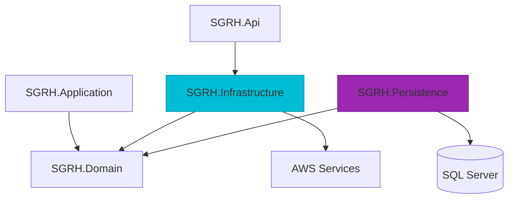

# Infrastructure Layer

The Infrastructure layer provides **concrete implementations** of abstractions defined in the Domain layer. This includes database access, external services (email, storage), and cross-cutting concerns.

## Layer Separation

SGRH splits infrastructure concerns into two projects:

<CardGroup cols={2}>
  <Card title="SGRH.Persistence" icon="database">
    **Data Access**: EF Core DbContext, repositories, SQL Server integration
  </Card>
  <Card title="SGRH.Infrastructure" icon="cloud">
    **External Services**: AWS S3 storage, AWS SES email, dependency injection
  </Card>
</CardGroup>



## Persistence Layer

### Project Structure

```
SGRH.Persistence/
├── Context/
│   └── SGRHDbContext.cs           # Main EF Core context
├── Configurations/                # Fluent API entity configurations
│   ├── ClienteConfiguration.cs
│   ├── HabitacionConfiguration.cs
│   ├── ReservaConfiguration.cs
│   ├── TarifaTemporadaConfiguration.cs
│   └── ...
├── Repositories/
│   ├── Base/
│   │   └── RepositoryBaseEF.cs    # Generic base repository
│   ├── ReservaRepositoryEF.cs
│   ├── HabitacionRepositoryEF.cs
│   ├── ClienteRepositoryEF.cs
│   └── ...
├── UnitOfWork/
│   └── UnitOfWork.cs              # Transaction coordination
├── Queries/
│   ├── ReservaQueries.cs          # Complex read queries
│   └── ReportesQueryService.cs    # Reporting queries
└── Migrations/                    # EF Core migrations
```

### DbContext Configuration

```csharp
public class SGRHDbContext : DbContext
{
    public SGRHDbContext(DbContextOptions<SGRHDbContext> options)
          : base(options)
    {
    }

    // CLIENTES
    public DbSet<Cliente> Clientes => Set<Cliente>();

    // HABITACIONES
    public DbSet<CategoriaHabitacion> CategoriasHabitacion => Set<CategoriaHabitacion>();
    public DbSet<Habitacion> Habitaciones => Set<Habitacion>();
    public DbSet<HabitacionHistorial> HabitacionHistorial => Set<HabitacionHistorial>();
    public DbSet<TarifaTemporada> TarifasTemporada => Set<TarifaTemporada>();

    // RESERVAS
    public DbSet<Reserva> Reservas => Set<Reserva>();
    public DbSet<DetalleReserva> DetallesReserva => Set<DetalleReserva>();
    public DbSet<ReservaServicioAdicional> ReservaServiciosAdicionales => Set<ReservaServicioAdicional>();

    // SERVICIOS
    public DbSet<ServicioAdicional> ServiciosAdicionales => Set<ServicioAdicional>();
    public DbSet<ServicioCategoriaPrecio> ServicioCategoriaPrecios => Set<ServicioCategoriaPrecio>();
    public DbSet<ServicioTemporada> ServicioTemporadas => Set<ServicioTemporada>();

    // TEMPORADAS
    public DbSet<Temporada> Temporadas => Set<Temporada>();

    // SEGURIDAD
    public DbSet<Usuario> Usuarios => Set<Usuario>();

    // AUDITORIA
    public DbSet<AuditoriaEvento> AuditoriaEventos => Set<AuditoriaEvento>();
    public DbSet<AuditoriaEventoDetalle> AuditoriaEventoDetalles => Set<AuditoriaEventoDetalle>();

    protected override void OnModelCreating(ModelBuilder modelBuilder)
    {
        // Apply all configurations from assembly
        modelBuilder.ApplyConfigurationsFromAssembly(typeof(SGRHDbContext).Assembly);

        // Explicit configurations for complex entities
        modelBuilder.ApplyConfiguration(new TarifaTemporadaConfiguration());
        modelBuilder.ApplyConfiguration(new ReservaServicioAdicionalConfiguration());
        modelBuilder.ApplyConfiguration(new DetalleReservaConfiguration());
        modelBuilder.ApplyConfiguration(new HabitacionHistorialConfiguration());
        modelBuilder.ApplyConfiguration(new AuditoriaEventoDetalleConfiguration());
        modelBuilder.ApplyConfiguration(new ServicioCategoriaPrecioConfiguration());
        modelBuilder.ApplyConfiguration(new ServicioTemporadaConfiguration());

        // One-to-One relationship configuration
        modelBuilder.Entity<Cliente>()
            .HasOne(e => e.Usuario)
            .WithOne(u => u.Cliente)
            .HasForeignKey<Usuario>(u => u.ClienteId)
            .IsRequired();

        base.OnModelCreating(modelBuilder);
    }
}
```

<Note>
  EF Core configurations are separated into individual files using `IEntityTypeConfiguration<T>` for better organization.
</Note>

### Repository Pattern

#### Base Repository

```csharp
public interface IRepository<TEntity, TKey>
    where TEntity : class
{
    Task<TEntity?> GetByIdAsync(TKey id, CancellationToken ct = default);
    Task AddAsync(TEntity entity, CancellationToken ct = default);
    void Update(TEntity entity);
    void Remove(TEntity entity);
    IQueryable<TEntity> Query();
}

public class Repository<TEntity, TKey> : IRepository<TEntity, TKey>
    where TEntity : class
{
    protected readonly SGRHDbContext Db;
    protected readonly DbSet<TEntity> Set;

    public Repository(SGRHDbContext db)
    {
        Db = db;
        Set = db.Set<TEntity>();
    }

    public virtual Task<TEntity?> GetByIdAsync(TKey id, CancellationToken ct = default)
        => Set.FindAsync([id], ct).AsTask();

    public virtual Task AddAsync(TEntity entity, CancellationToken ct = default)
        => Set.AddAsync(entity, ct).AsTask();

    public virtual void Update(TEntity entity) => Set.Update(entity);
    public virtual void Remove(TEntity entity) => Set.Remove(entity);
    public virtual IQueryable<TEntity> Query() => Set.AsQueryable();
}
```

#### Specialized Repository

Repositories can extend the base with domain-specific methods:

```csharp
public sealed class ReservaRepositoryEF : Repository<Reserva, int>, IReservaRepository
{
    public ReservaRepositoryEF(SGRHDbContext db) : base(db) { }

    // Specialized query: Load reservation with all details
    public Task<Reserva?> GetByIdWithDetallesAsync(int reservaId, CancellationToken ct = default)
        => Db.Reservas
            .Include(r => r.Habitaciones)
            .Include(r => r.Servicios)
            .FirstOrDefaultAsync(r => r.ReservaId == reservaId, ct);

    // Specialized query: Get all reservations for a client
    public Task<List<Reserva>> GetByClienteAsync(int clienteId, CancellationToken ct = default)
        => Db.Reservas
            .Where(r => r.ClienteId == clienteId)
            .OrderByDescending(r => r.FechaReserva)
            .ToListAsync(ct);
}
```

<Tip>
  Specialized repository methods encapsulate complex queries and eager loading strategies.
</Tip>

### Unit of Work

The UnitOfWork pattern coordinates transactions across multiple repositories:

```csharp
public interface IUnitOfWork
{
    Task<int> SaveChangesAsync(CancellationToken ct = default);
    Task BeginTransactionAsync(CancellationToken ct = default);
    Task CommitAsync(CancellationToken ct = default);
    Task RollbackAsync(CancellationToken ct = default);
}

public sealed class UnitOfWork : IUnitOfWork
{
    private readonly SGRHDbContext _db;
    private IDbContextTransaction? _tx;

    public UnitOfWork(SGRHDbContext db) => _db = db;

    public Task<int> SaveChangesAsync(CancellationToken ct = default)
        => _db.SaveChangesAsync(ct);

    public async Task BeginTransactionAsync(CancellationToken ct = default)
    {
        if (_tx is not null) return;
        _tx = await _db.Database.BeginTransactionAsync(ct);
    }

    public async Task CommitAsync(CancellationToken ct = default)
    {
        if (_tx is null) return;
        await _db.SaveChangesAsync(ct);
        await _tx.CommitAsync(ct);
        await _tx.DisposeAsync();
        _tx = null;
    }

    public async Task RollbackAsync(CancellationToken ct = default)
    {
        if (_tx is null) return;
        await _tx.RollbackAsync(ct);
        await _tx.DisposeAsync();
        _tx = null;
    }
}
```

### Query Services

Complex read operations are encapsulated in dedicated query services:

```
SGRH.Persistence/Queries/
├── ReservaQueries.cs              # Reservation-specific queries
├── ReportesQueryService.cs        # Reporting and analytics
└── Models/
    ├── OcupacionActivaRow.cs
    ├── ReservaCostoTotalRow.cs
    └── UsoServiciosRow.cs
```

<CodeGroup>
```csharp Occupancy Report
public class ReportesQueryService
{
    private readonly SGRHDbContext _db;

    public async Task<List<OcupacionActivaRow>> GetOcupacionActiva(
        DateTime fechaInicio, DateTime fechaFin, CancellationToken ct)
    {
        return await _db.Reservas
            .Where(r => r.EstadoReserva == EstadoReserva.Confirmada)
            .Where(r => r.FechaEntrada < fechaFin && r.FechaSalida > fechaInicio)
            .SelectMany(r => r.Habitaciones)
            .GroupBy(d => d.HabitacionId)
            .Select(g => new OcupacionActivaRow
            {
                HabitacionId = g.Key,
                DiasOcupados = g.Sum(d => EF.Functions.DateDiffDay(
                    d.Reserva.FechaEntrada, d.Reserva.FechaSalida)),
                NumeroReservas = g.Count()
            })
            .ToListAsync(ct);
    }
}
```

```csharp Revenue Report
public async Task<List<ReservaCostoTotalRow>> GetIngresoPorPeriodo(
    DateTime fechaInicio, DateTime fechaFin, CancellationToken ct)
{
    return await _db.Reservas
        .Where(r => r.EstadoReserva == EstadoReserva.Finalizada)
        .Where(r => r.FechaReserva >= fechaInicio && r.FechaReserva < fechaFin)
        .Select(r => new ReservaCostoTotalRow
        {
            ReservaId = r.ReservaId,
            FechaReserva = r.FechaReserva,
            CostoTotal = r.CostoTotal,
            CostoHabitaciones = r.Habitaciones.Sum(h => h.TarifaAplicada),
            CostoServicios = r.Servicios.Sum(s => s.SubTotal)
        })
        .ToListAsync(ct);
}
```
</CodeGroup>

## Infrastructure Services

### Project Structure

```
SGRH.Infrastructure/
├── StorageS3/
│   ├── S3StorageService.cs
│   └── Models/
│       └── S3Options.cs
├── EmailSES/
│   ├── SesEmailService.cs
│   └── Models/
│       └── SesOptions.cs
└── DependencyInjection/
    └── DependencyInjection.cs
```

### AWS S3 Storage

```csharp
public interface IFileStorage
{
    Task<string> UploadAsync(Stream fileStream, string fileName, string contentType);
    Task<Stream> DownloadAsync(string fileKey);
    Task DeleteAsync(string fileKey);
}

public class S3StorageService : IFileStorage
{
    private readonly IAmazonS3 _s3Client;
    private readonly S3Options _options;

    public async Task<string> UploadAsync(Stream fileStream, string fileName, string contentType)
    {
        var key = $"{DateTime.UtcNow:yyyy/MM/dd}/{Guid.NewGuid()}/{fileName}";
        
        var request = new PutObjectRequest
        {
            BucketName = _options.BucketName,
            Key = key,
            InputStream = fileStream,
            ContentType = contentType
        };

        await _s3Client.PutObjectAsync(request);
        return key;
    }
}
```

### AWS SES Email

```csharp
public interface IEmailSender
{
    Task SendAsync(string to, string subject, string body);
}

public class SesEmailService : IEmailSender
{
    private readonly IAmazonSimpleEmailService _sesClient;
    private readonly SesOptions _options;

    public async Task SendAsync(string to, string subject, string body)
    {
        var request = new SendEmailRequest
        {
            Source = _options.FromAddress,
            Destination = new Destination { ToAddresses = new List<string> { to } },
            Message = new Message
            {
                Subject = new Content(subject),
                Body = new Body { Html = new Content(body) }
            }
        };

        await _sesClient.SendEmailAsync(request);
    }
}
```

## Dependency Injection

All infrastructure services are registered in a centralized DI configuration:

```csharp
public static class DependencyInjection
{
    public static IServiceCollection AddInfrastructure(
        this IServiceCollection services, IConfiguration config)
    {
        // 1) DbContext (Persistence)
        var cs = config.GetConnectionString("Default");
        services.AddDbContext<SGRHDbContext>(opt =>
            opt.UseSqlServer(cs));

        // 2) UnitOfWork
        services.AddScoped<IUnitOfWork, UnitOfWork>();

        // 3) Repositories (Persistence)
        services.AddScoped<IAuditoriaRepository, AuditoriaRepositoryEF>();
        services.AddScoped<ICategoriaHabitacionRepository, CategoriaHabitacionRepositoryEF>();
        services.AddScoped<IClienteRepository, ClienteRepositoryEF>();
        services.AddScoped<IDetalleReservaRepository, DetalleReservaRepositoryEF>();
        services.AddScoped<IHabitacionHistorialRepository, HabitacionHistorialRepositoryEF>();
        services.AddScoped<IHabitacionRepository, HabitacionRepositoryEF>();
        services.AddScoped<IReservaRepository, ReservaRepositoryEF>();
        services.AddScoped<IReservaServicioAdicionalRepository, ReservaServicioAdicionalRepositoryEF>();
        services.AddScoped<IServicioCategoriaPrecioRepository, ServicioCategoriaPrecioRepositoryEF>();
        services.AddScoped<IServicioAdicionalRepository, ServicioAdicionalRepositoryEF>();
        services.AddScoped<IServicioTemporadaRepository, ServicioTemporadaRepositoryEF>();
        services.AddScoped<ITarifaTemporadaRepository, TarifaTemporadaRepositoryEF>();
        services.AddScoped<ITemporadaRepository, TemporadaRepositoryEF>();
        services.AddScoped<IUsuarioRepository, UsuarioRepositoryEF>();

        // 4) External services (when configured)
        // services.AddScoped<IEmailSender, SesEmailService>();
        // services.AddScoped<IFileStorage, S3StorageService>();

        return services;
    }
}
```

<Note>
  The `AddInfrastructure` extension method is called from `Program.cs` in the API project.
</Note>

## Database Provider Configuration

The system supports SQL Server by default, but can be configured for MySQL:

<Tabs>
  <Tab title="SQL Server">
    ```csharp
    services.AddDbContext<SGRHDbContext>(options =>
        options.UseSqlServer(builder.Configuration.GetConnectionString("Default")));
    ```
    
    **Connection String:**
    ```json
    {
      "ConnectionStrings": {
        "Default": "Server=localhost;Database=SGRH;User Id=sa;Password=***;TrustServerCertificate=true;"
      }
    }
    ```
  </Tab>
  
  <Tab title="MySQL">
    ```csharp
    services.AddDbContext<SGRHDbContext>(options =>
        options.UseMySql(
            builder.Configuration.GetConnectionString("Default"),
            ServerVersion.AutoDetect(builder.Configuration.GetConnectionString("Default"))));
    ```
    
    **Connection String:**
    ```json
    {
      "ConnectionStrings": {
        "Default": "Server=localhost;Database=sgrh;User=root;Password=***;"
      }
    }
    ```
  </Tab>
</Tabs>

## Migration Strategy

<Steps>
  <Step title="Add Migration">
    ```bash
    dotnet ef migrations add InitialCreate --project SGRH.Persistence --startup-project SGRH.Api
    ```
  </Step>
  
  <Step title="Update Database">
    ```bash
    dotnet ef database update --project SGRH.Persistence --startup-project SGRH.Api
    ```
  </Step>
  
  <Step title="Generate SQL Script">
    ```bash
    dotnet ef migrations script --project SGRH.Persistence --startup-project SGRH.Api -o migration.sql
    ```
  </Step>
</Steps>

## Key Design Decisions

<CardGroup cols={2}>
  <Card title="Repository Abstraction" icon="diagram-project">
    Interfaces in Domain, implementations in Persistence - true dependency inversion
  </Card>
  <Card title="Specialized Queries" icon="magnifying-glass-chart">
    Complex reads bypass repositories and use DbContext directly for performance
  </Card>
  <Card title="Configuration Separation" icon="folder-tree">
    Entity configurations in separate files using IEntityTypeConfiguration&lt;T&gt;
  </Card>
  <Card title="External Service Abstraction" icon="plug">
    Email and storage are abstracted for testability and provider flexibility
  </Card>
</CardGroup>

## Related Documentation

<CardGroup cols={3}>
  <Card title="Domain Layer" href="/architecture/domain-layer" icon="cube">
    See repository interfaces defined in Domain
  </Card>
  <Card title="Application Layer" href="/architecture/application-layer" icon="gears">
    Learn how use cases consume repositories
  </Card>
  <Card title="API Layer" href="/architecture/api-layer" icon="network-wired">
    Understand DI registration in Program.cs
  </Card>
</CardGroup>
