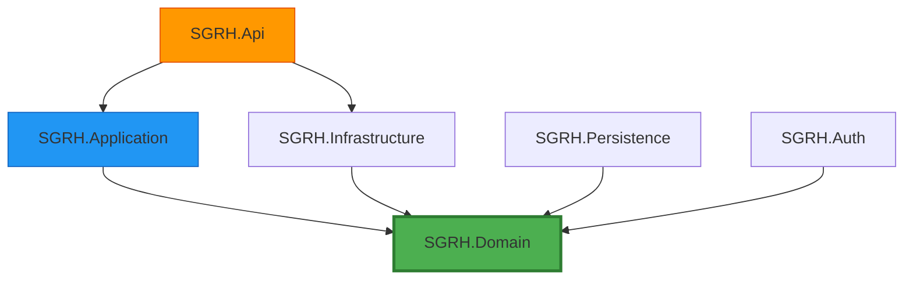

# Architecture Overview

SGRH (Sistema de Gestión de Reservas Hoteleras) follows **Clean Architecture** principles with clear separation of concerns across multiple layers. The system is designed to be maintainable, testable, and scalable.

## Architectural Principles

<CardGroup cols={2}>
  <Card title="Dependency Inversion" icon="arrow-down-up-across-line">
    Dependencies point inward: Infrastructure and API depend on Domain, never the reverse
  </Card>
  <Card title="Domain-Driven Design" icon="cube">
    Business logic is encapsulated in rich domain entities with behavior
  </Card>
  <Card title="CQRS Pattern" icon="code-branch">
    Commands for writes and Queries for reads are separated in the Application layer
  </Card>
  <Card title="Repository Pattern" icon="database">
    Data access is abstracted through repository interfaces defined in Domain
  </Card>
</CardGroup>

## Layer Structure

The system is organized into the following layers:

```
SGRH.Api/              # Presentation Layer - REST API Controllers
SGRH.Application/      # Application Layer - Use Cases (CQRS)
SGRH.Domain/           # Domain Layer - Business Logic & Entities
SGRH.Infrastructure/   # Infrastructure - External Services (S3, SES)
SGRH.Persistence/      # Persistence - EF Core & Repositories
SGRH.Auth/             # Authentication & Authorization
```

<Note>
  The **Domain layer** has no dependencies on other projects. All other layers depend on Domain.
</Note>

## Dependency Flow



## Core Entities

The domain model includes the following core entities:

<Tabs>
  <Tab title="Reservations">
    - **Reserva**: Main reservation aggregate root with state machine (Pendiente → Confirmada → Finalizada)
    - **DetalleReserva**: Room details within a reservation with pricing snapshot
    - **ReservaServicioAdicional**: Additional services attached to reservations
  </Tab>
  <Tab title="Rooms">
    - **Habitacion**: Room entity with category and floor information
    - **CategoriaHabitacion**: Room categories (Simple, Doble, Suite, etc.)
    - **HabitacionHistorial**: Temporal state tracking for room status changes
  </Tab>
  <Tab title="Clients">
    - **Cliente**: Customer information with validation guards
    - Includes NationalId, Email, Telefono with domain constraints
  </Tab>
  <Tab title="Services & Seasons">
    - **ServicioAdicional**: Additional hotel services (Spa, Restaurant, etc.)
    - **Temporada**: Seasonal periods for dynamic pricing
    - **TarifaTemporada**: Pricing per room category and season
  </Tab>
</Tabs>

## Domain-Driven Patterns

### Entity Base Class

All entities inherit from `EntityBase` which provides identity equality:

```csharp
public abstract class EntityBase
{
    protected abstract object GetKey();

    public override bool Equals(object? obj)
    {
        if (obj is not EntityBase other) return false;
        if (ReferenceEquals(this, other)) return true;
        if (GetType() != other.GetType()) return false;
        return GetKey().Equals(other.GetKey());
    }

    public override int GetHashCode() => GetKey().GetHashCode();
}
```

### Guard Clauses

Domain validation is enforced through guard clauses:

```csharp
public static class Guard
{
    public static void AgainstNullOrWhiteSpace(string? value, string name, int maxLength)
    {
        if (string.IsNullOrWhiteSpace(value))
            throw new ValidationException($"{name} no puede estar vacío.");

        if (value.Length > maxLength)
            throw new ValidationException($"{name} supera el máximo de {maxLength} caracteres.");
    }

    public static void AgainstOutOfRange(int value, string name, int minExclusive)
    {
        if (value <= minExclusive)
            throw new ValidationException($"{name} debe ser mayor a {minExclusive}.");
    }
}
```

### Domain Policies

Complex business rules are encapsulated in policy interfaces:

```csharp
public interface IReservaDomainPolicy
{
    int? GetTemporadaId(DateTime fechaEntrada);
    void EnsureHabitacionDisponible(int habitacionId, DateTime fechaEntrada, 
                                     DateTime fechaSalida, int? reservaId);
    void EnsureHabitacionNoEnMantenimiento(int habitacionId, DateTime fechaEntrada, 
                                           DateTime fechaSalida);
    decimal GetTarifaAplicada(int habitacionId, DateTime fechaEntrada);
    void EnsureServicioDisponibleEnTemporada(int servicioAdicionalId, int? temporadaId);
    decimal GetPrecioServicioAplicado(int reservaId, int servicioAdicionalId);
}
```

## Technology Stack

<CardGroup cols={3}>
  <Card title=".NET 8" icon="microsoft">
    Modern C# features and performance improvements
  </Card>
  <Card title="Entity Framework Core" icon="table">
    ORM for data access with SQL Server
  </Card>
  <Card title="ASP.NET Core" icon="globe">
    Web API framework for REST endpoints
  </Card>
</CardGroup>

## Database Strategy

- **ORM**: Entity Framework Core
- **Database**: SQL Server / MySQL (configurable)
- **Migrations**: Code-first approach
- **Configuration**: Fluent API in `Persistence` layer

<Tip>
  The connection string in `Program.cs` references `"Default"` - ensure your `appsettings.json` has this configured.
</Tip>

## Next Steps

<CardGroup cols={2}>
  <Card title="Domain Layer" href="/architecture/domain-layer" icon="diagram-project">
    Explore entities, value objects, and domain logic
  </Card>
  <Card title="Application Layer" href="/architecture/application-layer" icon="gears">
    Learn about CQRS commands and queries
  </Card>
  <Card title="Infrastructure Layer" href="/architecture/infrastructure-layer" icon="server">
    Understand repository implementations
  </Card>
  <Card title="API Layer" href="/architecture/api-layer" icon="network-wired">
    Review REST API controllers and endpoints
  </Card>
</CardGroup>
