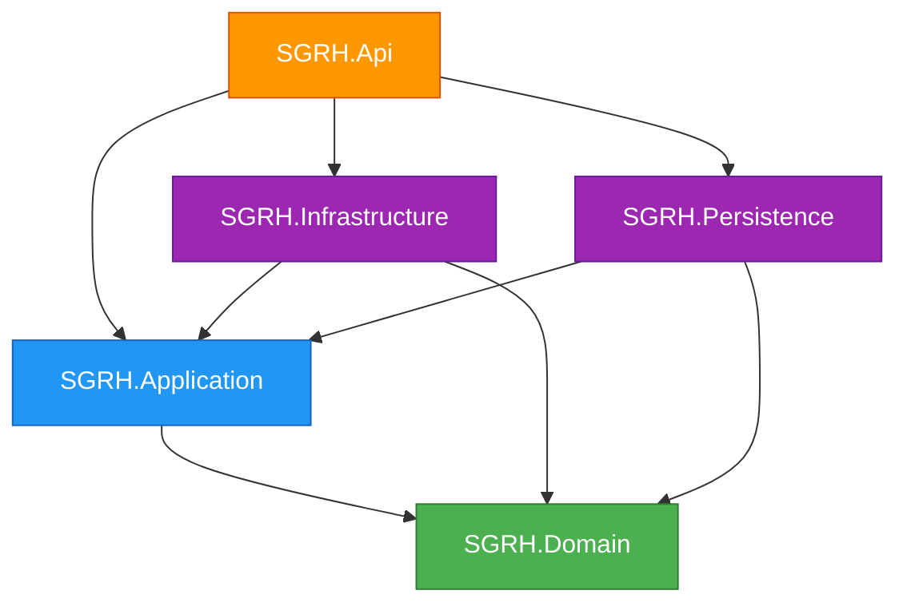

## Overview

SGRH implements **Clean Architecture** principles to ensure separation of concerns, maintainability, and testability. The system is organized into distinct layers, each with specific responsibilities and clear dependency rules.

<Note>
The key principle: **Dependencies flow inward**. Outer layers depend on inner layers, but inner layers never depend on outer layers.
</Note>

## Architecture Layers

<Steps>
  <Step title="Domain Layer (Core)">
    The innermost layer containing business logic, entities, and domain rules. Has **zero dependencies** on other layers.
    
    - **Location**: `SGRH.Domain/`
    - **Contains**: Entities, Value Objects, Domain Events, Exceptions, Enums
    - **Dependencies**: None (pure C# business logic)
  </Step>

  <Step title="Application Layer">
    Contains use cases and orchestrates domain objects to fulfill business requirements.
    
    - **Location**: `SGRH.Application/`
    - **Contains**: Commands, Queries, DTOs, Mappings, Application Services
    - **Dependencies**: Only `SGRH.Domain`
    - **Frameworks**: MediatR, FluentValidation
  </Step>

  <Step title="Infrastructure Layer">
    Implements interfaces defined by domain/application layers for external concerns.
    
    - **Location**: `SGRH.Infrastructure/`, `SGRH.Persistence/`
    - **Contains**: Database access, Email services, File storage (S3), External APIs
    - **Dependencies**: `SGRH.Domain`, `SGRH.Application`
  </Step>

  <Step title="Presentation Layer">
    Exposes the application to external consumers (API, Desktop app).
    
    - **Location**: `SGRH.Api/`, `Desktop/`
    - **Contains**: Controllers, API endpoints, UI components
    - **Dependencies**: `SGRH.Application`, `SGRH.Infrastructure`
  </Step>
</Steps>

## Project Structure

```
SGRH/
├── SGRH.Domain/              # Core business logic
│   ├── Entities/             # Domain entities
│   ├── Abstractions/         # Interfaces (repositories, policies)
│   ├── Enums/                # Domain enumerations
│   ├── Exceptions/           # Domain exceptions
│   └── Base/                 # Base classes (EntityBase)
│
├── SGRH.Application/         # Use cases & orchestration
│   ├── Features/             # CQRS commands & queries
│   ├── DTOs/                 # Data transfer objects
│   └── Common/               # Shared application logic
│
├── SGRH.Persistence/         # Data access implementation
│   ├── Context/              # EF Core DbContext
│   ├── Repositories/         # Repository implementations
│   ├── Configurations/       # EF entity configurations
│   └── UnitOfWork/           # Transaction management
│
├── SGRH.Infrastructure/      # External services
│   ├── EmailSES/             # AWS SES email service
│   └── StorageS3/            # AWS S3 file storage
│
└── SGRH.Api/                 # REST API
    ├── Controllers/          # API endpoints
    └── Program.cs            # App configuration
```

## Dependency Flow



<Tip>
Notice how `SGRH.Domain` has no outgoing arrows - it depends on **nothing**. This is the hallmark of Clean Architecture.
</Tip>

## Implementation Examples

### Domain Layer Independence

The domain layer defines **interfaces** for what it needs, but doesn't implement them:

<CodeGroup>
```csharp SGRH.Domain/Abstractions/Repositories/IRepository.cs
namespace SGRH.Domain.Abstractions.Repositories;

public interface IRepository<T, TKey> where T : class
{
    Task<T?> GetByIdAsync(TKey id, CancellationToken ct = default);
    Task<List<T>> GetAllAsync(CancellationToken ct = default);
    Task AddAsync(T entity, CancellationToken ct = default);
    void Update(T entity);
    void Delete(T entity);
}
```

```csharp SGRH.Domain/Abstractions/Repositories/IUnitOfWork.cs
namespace SGRH.Domain.Abstractions.Repositories;

public interface IUnitOfWork
{
    Task<int> SaveChangesAsync(CancellationToken ct = default);
    Task BeginTransactionAsync(CancellationToken ct = default);
    Task CommitAsync(CancellationToken ct = default);
    Task RollbackAsync(CancellationToken ct = default);
}
```
</CodeGroup>

### Persistence Layer Implementation

The persistence layer **implements** domain interfaces using Entity Framework:

```csharp SGRH.Persistence/UnitOfWork/UnitOfWork.cs
using SGRH.Persistence.Context;
using SGRH.Domain.Abstractions.Repositories;

public sealed class UnitOfWork : IUnitOfWork
{
    private readonly SGRHDbContext _db;
    private IDbContextTransaction? _tx;

    public UnitOfWork(SGRHDbContext db) => _db = db;

    public Task<int> SaveChangesAsync(CancellationToken ct = default)
        => _db.SaveChangesAsync(ct);

    public async Task BeginTransactionAsync(CancellationToken ct = default)
    {
        if (_tx is not null) return;
        _tx = await _db.Database.BeginTransactionAsync(ct);
    }

    public async Task CommitAsync(CancellationToken ct = default)
    {
        if (_tx is null) return;
        await _db.SaveChangesAsync(ct);
        await _tx.CommitAsync(ct);
        await _tx.DisposeAsync();
        _tx = null;
    }

    public async Task RollbackAsync(CancellationToken ct = default)
    {
        if (_tx is null) return;
        await _tx.RollbackAsync(ct);
        await _tx.DisposeAsync();
        _tx = null;
    }
}
```

### Domain Services

Complex business rules are encapsulated in domain policies:

```csharp SGRH.Domain/Abstractions/Policies/IReservaDomainPolicy.cs
namespace SGRH.Domain.Abstractions.Policies;

public interface IReservaDomainPolicy
{
    // Get season ID for entry date (nullable if no season)
    int? GetTemporadaId(DateTime fechaEntrada);

    // Validate room availability for date range
    void EnsureHabitacionDisponible(
        int habitacionId, 
        DateTime fechaEntrada, 
        DateTime fechaSalida, 
        int? reservaId);

    // Validate room is NOT in maintenance
    void EnsureHabitacionNoEnMantenimiento(
        int habitacionId, 
        DateTime fechaEntrada, 
        DateTime fechaSalida);

    // Get applicable rate for room and date
    decimal GetTarifaAplicada(int habitacionId, DateTime fechaEntrada);

    // Validate service availability for season
    void EnsureServicioDisponibleEnTemporada(
        int servicioAdicionalId, 
        int? temporadaId);

    // Get service unit price for reservation
    decimal GetPrecioServicioAplicado(
        int reservaId, 
        int servicioAdicionalId);
}
```

<Note>
The domain **defines** the policy interface, but the implementation lives in `SGRH.Persistence` where it can access the database.
</Note>

## Benefits of This Architecture

### 1. Testability

- Domain logic can be tested without databases or external services
- Application use cases can be tested with mocked repositories
- Each layer can be tested independently

### 2. Maintainability

- Changes to infrastructure (e.g., switching databases) don't affect business logic
- Business rules are centralized in the domain layer
- Clear separation makes code easier to navigate

### 3. Framework Independence

- Business logic is pure C# - no framework dependencies
- Can swap Entity Framework for Dapper without touching domain
- Can change from REST API to gRPC by only changing presentation layer

### 4. Flexibility

- Multiple presentation layers (API + Desktop app) share the same application layer
- Infrastructure can be swapped (e.g., AWS SES → SendGrid)
- Domain remains stable while outer layers evolve

## DbContext Configuration

The `SGRHDbContext` is configured in the presentation layer but used by the persistence layer:

```csharp SGRH.Api/Program.cs
var builder = WebApplication.CreateBuilder(args);

builder.Services.AddDbContext<SGRHDbContext>(options =>
    options.UseSqlServer(builder.Configuration.GetConnectionString("Default")));
```

```csharp SGRH.Persistence/Context/SGRHDbContext.cs
using Microsoft.EntityFrameworkCore;
using SGRH.Domain.Entities;

public class SGRHDbContext : DbContext
{
    public SGRHDbContext(DbContextOptions<SGRHDbContext> options)
        : base(options) { }

    // Entity sets
    public DbSet<Cliente> Clientes => Set<Cliente>();
    public DbSet<Reserva> Reservas => Set<Reserva>();
    public DbSet<Habitacion> Habitaciones => Set<Habitacion>();
    // ... more entities

    protected override void OnModelCreating(ModelBuilder modelBuilder)
    {
        // Apply all configurations from assembly
        modelBuilder.ApplyConfigurationsFromAssembly(typeof(SGRHDbContext).Assembly);
        base.OnModelCreating(modelBuilder);
    }
}
```

## Best Practices

<CardGroup cols={2}>
  <Card title="Keep Domain Pure" icon="shield-check">
    Never reference external frameworks in the domain layer. Use only pure C# and .NET standard libraries.
  </Card>
  
  <Card title="Define Abstractions" icon="puzzle-piece">
    When domain needs external data, define an interface in `Domain/Abstractions/` and implement it in infrastructure.
  </Card>
  
  <Card title="Use Dependency Injection" icon="arrows-turn-to-dots">
    All dependencies should be injected through constructors, following the Dependency Inversion Principle.
  </Card>
  
  <Card title="Separate Concerns" icon="layer-group">
    Each layer should have a single responsibility. Don't mix business logic with data access or presentation.
  </Card>
</CardGroup>

## Common Pitfalls to Avoid

<Warning>
**Don't reference outer layers from inner layers**

Bad:
```csharp
// In SGRH.Domain - DON'T DO THIS!
using SGRH.Persistence;
using Microsoft.EntityFrameworkCore;
```

Good:
```csharp
// In SGRH.Domain - Define abstractions
namespace SGRH.Domain.Abstractions.Repositories;
public interface IClienteRepository { ... }
```
</Warning>

<Warning>
**Don't put business logic in controllers or repositories**

Business logic belongs in domain entities or domain services, not in infrastructure or presentation layers.
</Warning>

## Related Concepts

<CardGroup cols={2}>
  <Card title="Domain-Driven Design" icon="cube" href="/concepts/domain-driven-design">
    Learn how DDD patterns structure the domain layer
  </Card>
  
  <Card title="CQRS Pattern" icon="split" href="/concepts/cqrs-pattern">
    Understand how commands and queries separate concerns
  </Card>
</CardGroup>
