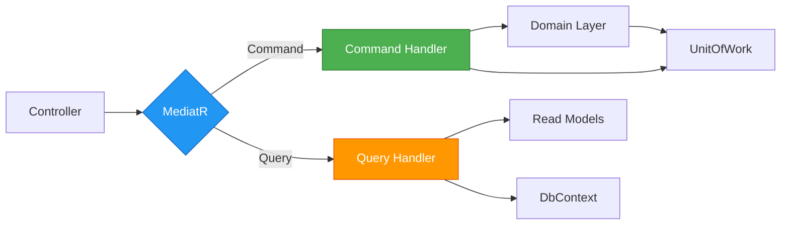

## Overview

**CQRS (Command Query Responsibility Segregation)** is a pattern that separates read operations (queries) from write operations (commands). SGRH implements CQRS using **MediatR** to organize application use cases.

<Note>
CQRS helps maintain clean separation between operations that modify state (commands) and operations that retrieve data (queries).
</Note>

## Architecture Overview



## Project Structure

```
SGRH.Application/
├── Features/
│   ├── Clientes/
│   │   ├── Commands/
│   │   │   ├── CrearCliente.cs          # Command + Handler
│   │   │   ├── ActualizarCliente.cs
│   │   │   └── EliminarCliente.cs
│   │   └── Queries/
│   │       ├── ObtenerClientePorId.cs   # Query + Handler
│   │       └── ListarClientes.cs
│   ├── Reservas/
│   │   ├── Commands/
│   │   │   ├── ConfirmarReserva.cs
│   │   │   ├── CancelarReserva.cs
│   │   │   ├── CheckIn.cs
│   │   │   └── CheckOut.cs
│   │   └── Queries/
│   │       ├── ObtenerReservaPorId.cs
│   │       └── ListarReservas.cs
│   └── Habitaciones/
│       ├── Commands/
│       │   ├── CrearHabitacion.cs
│       │   ├── ActualizarHabitacion.cs
│       │   └── CambiarEstadoHabitacion.cs
│       └── Queries/
│           ├── ObtenerHabitacionPorId.cs
│           └── ListarHabitaciones.cs
└── DTOs/
    ├── Clientes/
    │   ├── Requests/
    │   │   ├── CrearClienteRequest.cs
    │   │   └── ActualizarClienteRequest.cs
    │   └── Responses/
    │       ├── ClienteResponse.cs
    │       └── ClienteDetalleResponse.cs
    └── ...
```

## Commands vs Queries

<CardGroup cols={2}>
  <Card title="Commands" icon="pen-to-square">
    **Purpose**: Change system state
    
    **Characteristics**:
    - Modify domain entities
    - Use UnitOfWork for transactions
    - Validate business rules
    - Return simple results (ID, success/fail)
    - May trigger side effects (emails, events)
    
    **Examples**:
    - `CrearClienteCommand`
    - `ConfirmarReservaCommand`
    - `CambiarEstadoHabitacionCommand`
  </Card>
  
  <Card title="Queries" icon="magnifying-glass">
    **Purpose**: Retrieve data
    
    **Characteristics**:
    - Read-only operations
    - Return DTOs, not domain entities
    - Can bypass domain layer for performance
    - No side effects
    - Can use optimized queries (projections)
    
    **Examples**:
    - `ObtenerClientePorIdQuery`
    - `ListarReservasQuery`
    - `GenerarReporteOcupacionQuery`
  </Card>
</CardGroup>

## MediatR Integration

SGRH uses **MediatR** to implement the mediator pattern for CQRS:

```xml SGRH.Application/SGRH.Application.csproj
<ItemGroup>
  <PackageReference Include="FluentValidation" Version="12.1.1" />
  <PackageReference Include="FluentValidation.DependencyInjectionExtensions" Version="12.1.1" />
  <PackageReference Include="MediatR" Version="14.0.0" />
</ItemGroup>
```

### Request/Response Pattern

<Tabs>
  <Tab title="Command">
    Commands implement `IRequest<TResponse>` and return a result:
    
    ```csharp CrearClienteCommand.cs
    using MediatR;
    using SGRH.Application.Common.Results;
    
    namespace SGRH.Application.Features.Clientes.Commands;
    
    public record CrearClienteCommand(
        string NationalId,
        string NombreCliente,
        string ApellidoCliente,
        string Email,
        string Telefono
    ) : IRequest<Result<int>>;
    
    public class CrearClienteCommandHandler 
        : IRequestHandler<CrearClienteCommand, Result<int>>
    {
        private readonly IClienteRepository _clienteRepo;
        private readonly IUnitOfWork _unitOfWork;
    
        public CrearClienteCommandHandler(
            IClienteRepository clienteRepo,
            IUnitOfWork unitOfWork)
        {
            _clienteRepo = clienteRepo;
            _unitOfWork = unitOfWork;
        }
    
        public async Task<Result<int>> Handle(
            CrearClienteCommand request, 
            CancellationToken cancellationToken)
        {
            // 1. Validate uniqueness
            var existente = await _clienteRepo
                .GetByNationalIdAsync(request.NationalId, cancellationToken);
                
            if (existente is not null)
                return Result<int>.Failure(
                    "Ya existe un cliente con ese documento.");
    
            // 2. Create domain entity
            var cliente = new Cliente(
                request.NationalId,
                request.NombreCliente,
                request.ApellidoCliente,
                request.Email,
                request.Telefono
            );
    
            // 3. Persist
            await _clienteRepo.AddAsync(cliente, cancellationToken);
            await _unitOfWork.SaveChangesAsync(cancellationToken);
    
            return Result<int>.Success(cliente.ClienteId);
        }
    }
    ```
  </Tab>
  
  <Tab title="Query">
    Queries implement `IRequest<TResponse>` and return DTOs:
    
    ```csharp ObtenerClientePorIdQuery.cs
    using MediatR;
    using SGRH.Application.Common.Results;
    using SGRH.Application.DTOs.Clientes.Responses;
    
    namespace SGRH.Application.Features.Clientes.Queries;
    
    public record ObtenerClientePorIdQuery(int ClienteId) 
        : IRequest<Result<ClienteDetalleResponse>>;
    
    public class ObtenerClientePorIdQueryHandler 
        : IRequestHandler<ObtenerClientePorIdQuery, Result<ClienteDetalleResponse>>
    {
        private readonly IClienteRepository _clienteRepo;
    
        public ObtenerClientePorIdQueryHandler(IClienteRepository clienteRepo)
        {
            _clienteRepo = clienteRepo;
        }
    
        public async Task<Result<ClienteDetalleResponse>> Handle(
            ObtenerClientePorIdQuery request,
            CancellationToken cancellationToken)
        {
            var cliente = await _clienteRepo
                .GetByIdAsync(request.ClienteId, cancellationToken);
    
            if (cliente is null)
                return Result<ClienteDetalleResponse>.Failure(
                    $"Cliente con ID {request.ClienteId} no encontrado.");
    
            var response = new ClienteDetalleResponse
            {
                ClienteId = cliente.ClienteId,
                NationalId = cliente.NationalId,
                NombreCompleto = $"{cliente.NombreCliente} {cliente.ApellidoCliente}",
                Email = cliente.Email,
                Telefono = cliente.Telefono
            };
    
            return Result<ClienteDetalleResponse>.Success(response);
        }
    }
    ```
  </Tab>
</Tabs>

## Command Pattern Deep Dive

### Complex Command Example: ConfirmarReserva

Commands can orchestrate complex business operations:

```csharp ConfirmarReservaCommand.cs
using MediatR;
using SGRH.Domain.Abstractions.Repositories;
using SGRH.Domain.Abstractions.Email;
using SGRH.Application.Common.Results;

namespace SGRH.Application.Features.Reservas.Commands;

public record ConfirmarReservaCommand(int ReservaId) 
    : IRequest<Result<bool>>;

public class ConfirmarReservaCommandHandler 
    : IRequestHandler<ConfirmarReservaCommand, Result<bool>>
{
    private readonly IReservaRepository _reservaRepo;
    private readonly IHabitacionRepository _habitacionRepo;
    private readonly IEmailSender _emailSender;
    private readonly IUnitOfWork _unitOfWork;

    public ConfirmarReservaCommandHandler(
        IReservaRepository reservaRepo,
        IHabitacionRepository habitacionRepo,
        IEmailSender emailSender,
        IUnitOfWork unitOfWork)
    {
        _reservaRepo = reservaRepo;
        _habitacionRepo = habitacionRepo;
        _emailSender = emailSender;
        _unitOfWork = unitOfWork;
    }

    public async Task<Result<bool>> Handle(
        ConfirmarReservaCommand request,
        CancellationToken cancellationToken)
    {
        // 1. Load aggregate with all related entities
        var reserva = await _reservaRepo
            .GetByIdWithDetailsAsync(request.ReservaId, cancellationToken);

        if (reserva is null)
            return Result<bool>.Failure(
                $"Reserva con ID {request.ReservaId} no encontrada.");

        // 2. Execute business logic (domain method enforces rules)
        try
        {
            reserva.Confirmar();
        }
        catch (BusinessRuleViolationException ex)
        {
            return Result<bool>.Failure(ex.Message);
        }

        // 3. Mark rooms as occupied
        foreach (var detalle in reserva.Habitaciones)
        {
            var habitacion = await _habitacionRepo
                .GetByIdAsync(detalle.HabitacionId, cancellationToken);
                
            if (habitacion is not null)
                habitacion.CambiarEstado(EstadoHabitacion.Ocupada);
        }

        // 4. Persist changes in transaction
        await _unitOfWork.BeginTransactionAsync(cancellationToken);
        try
        {
            _reservaRepo.Update(reserva);
            await _unitOfWork.SaveChangesAsync(cancellationToken);
            await _unitOfWork.CommitAsync(cancellationToken);
        }
        catch
        {
            await _unitOfWork.RollbackAsync(cancellationToken);
            throw;
        }

        // 5. Send confirmation email (side effect - outside transaction)
        await EnviarEmailConfirmacionAsync(reserva, cancellationToken);

        return Result<bool>.Success(true);
    }

    private async Task EnviarEmailConfirmacionAsync(
        Reserva reserva, 
        CancellationToken ct)
    {
        var mensaje = new EmailMessage
        {
            To = new[] { new EmailRecipient(reserva.Cliente.Email) },
            Subject = $"Confirmación de Reserva #{reserva.ReservaId}",
            Body = $"Su reserva ha sido confirmada para {reserva.FechaEntrada:d}."
        };

        await _emailSender.SendAsync(mensaje, ct);
    }
}
```

**Command Handler Responsibilities:**

<Steps>
  <Step title="Load Entities">
    Retrieve necessary domain entities and aggregates from repositories.
  </Step>
  
  <Step title="Execute Business Logic">
    Call domain methods that enforce business rules. Handle domain exceptions.
  </Step>
  
  <Step title="Coordinate Changes">
    Orchestrate changes across multiple aggregates if needed.
  </Step>
  
  <Step title="Persist in Transaction">
    Use UnitOfWork to save all changes atomically.
  </Step>
  
  <Step title="Trigger Side Effects">
    Send emails, publish events, etc. (outside transaction).
  </Step>
</Steps>

## Query Pattern Deep Dive

### Simple Query Example

Queries can directly query the database for read models:

```csharp ListarClientesQuery.cs
using MediatR;
using Microsoft.EntityFrameworkCore;
using SGRH.Persistence.Context;
using SGRH.Application.DTOs.Clientes.Responses;
using SGRH.Application.Common.Results;

namespace SGRH.Application.Features.Clientes.Queries;

public record ListarClientesQuery(
    string? Filtro = null,
    int Pagina = 1,
    int TamañoPagina = 20
) : IRequest<PagedResult<ClienteResponse>>;

public class ListarClientesQueryHandler 
    : IRequestHandler<ListarClientesQuery, PagedResult<ClienteResponse>>
{
    private readonly SGRHDbContext _context;

    public ListarClientesQueryHandler(SGRHDbContext context)
    {
        _context = context;
    }

    public async Task<PagedResult<ClienteResponse>> Handle(
        ListarClientesQuery request,
        CancellationToken cancellationToken)
    {
        var query = _context.Clientes.AsQueryable();

        // Apply filter
        if (!string.IsNullOrWhiteSpace(request.Filtro))
        {
            query = query.Where(c => 
                c.NombreCliente.Contains(request.Filtro) ||
                c.ApellidoCliente.Contains(request.Filtro) ||
                c.Email.Contains(request.Filtro) ||
                c.NationalId.Contains(request.Filtro)
            );
        }

        // Get total count
        var totalItems = await query.CountAsync(cancellationToken);

        // Apply pagination and projection
        var items = await query
            .OrderBy(c => c.ApellidoCliente)
            .ThenBy(c => c.NombreCliente)
            .Skip((request.Pagina - 1) * request.TamañoPagina)
            .Take(request.TamañoPagina)
            .Select(c => new ClienteResponse
            {
                ClienteId = c.ClienteId,
                NombreCompleto = $"{c.NombreCliente} {c.ApellidoCliente}",
                Email = c.Email,
                Telefono = c.Telefono
            })
            .ToListAsync(cancellationToken);

        return new PagedResult<ClienteResponse>
        {
            Items = items,
            TotalItems = totalItems,
            Pagina = request.Pagina,
            TamañoPagina = request.TamañoPagina
        };
    }
}
```

<Tip>
**Performance Optimization**: Queries can bypass the domain layer and use EF projections (`Select`) to load only the data needed for the DTO. This is more efficient than loading full entities.
</Tip>

### Complex Query Example: Reports

Queries can execute complex aggregations:

```csharp GenerarReporteOcupacionQuery.cs
using MediatR;
using Microsoft.EntityFrameworkCore;
using SGRH.Persistence.Context;
using SGRH.Application.DTOs.Reportes;
using SGRH.Domain.Enums;

namespace SGRH.Application.Features.Reportes.Queries;

public record GenerarReporteOcupacionQuery(
    DateTime FechaInicio,
    DateTime FechaFin,
    AgrupacionTemporal Agrupacion
) : IRequest<ReporteOcupacionResponse>;

public class GenerarReporteOcupacionQueryHandler
    : IRequestHandler<GenerarReporteOcupacionQuery, ReporteOcupacionResponse>
{
    private readonly SGRHDbContext _context;

    public GenerarReporteOcupacionQueryHandler(SGRHDbContext context)
    {
        _context = context;
    }

    public async Task<ReporteOcupacionResponse> Handle(
        GenerarReporteOcupacionQuery request,
        CancellationToken cancellationToken)
    {
        var totalHabitaciones = await _context.Habitaciones.CountAsync(cancellationToken);

        var ocupacion = await _context.Reservas
            .Where(r => 
                r.EstadoReserva == EstadoReserva.Confirmada &&
                r.FechaEntrada >= request.FechaInicio &&
                r.FechaSalida <= request.FechaFin)
            .SelectMany(r => r.Habitaciones)
            .GroupBy(d => d.HabitacionId)
            .Select(g => new
            {
                HabitacionId = g.Key,
                DiasOcupados = g.Count()
            })
            .ToListAsync(cancellationToken);

        var diasPeriodo = (request.FechaFin - request.FechaInicio).Days;
        var tasaOcupacion = ocupacion.Count > 0
            ? (ocupacion.Sum(o => o.DiasOcupados) / (double)(totalHabitaciones * diasPeriodo)) * 100
            : 0;

        return new ReporteOcupacionResponse
        {
            FechaInicio = request.FechaInicio,
            FechaFin = request.FechaFin,
            TotalHabitaciones = totalHabitaciones,
            TasaOcupacionPromedio = Math.Round(tasaOcupacion, 2),
            DetalleOcupacion = ocupacion.Select(o => new OcupacionDetalle
            {
                HabitacionId = o.HabitacionId,
                DiasOcupados = o.DiasOcupados,
                Porcentaje = Math.Round((o.DiasOcupados / (double)diasPeriodo) * 100, 2)
            }).ToList()
        };
    }
}
```

## DTOs (Data Transfer Objects)

### Request DTOs

Define input data for commands:

```csharp CrearClienteRequest.cs
namespace SGRH.Application.DTOs.Clientes.Requests;

public class CrearClienteRequest
{
    public string NationalId { get; set; } = string.Empty;
    public string NombreCliente { get; set; } = string.Empty;
    public string ApellidoCliente { get; set; } = string.Empty;
    public string Email { get; set; } = string.Empty;
    public string Telefono { get; set; } = string.Empty;
}
```

### Response DTOs

Define output data for queries:

```csharp ClienteResponse.cs
namespace SGRH.Application.DTOs.Clientes.Responses;

public class ClienteResponse
{
    public int ClienteId { get; set; }
    public string NombreCompleto { get; set; } = string.Empty;
    public string Email { get; set; } = string.Empty;
    public string Telefono { get; set; } = string.Empty;
}
```

```csharp ClienteDetalleResponse.cs
namespace SGRH.Application.DTOs.Clientes.Responses;

public class ClienteDetalleResponse : ClienteResponse
{
    public string NationalId { get; set; } = string.Empty;
    public DateTime FechaRegistro { get; set; }
    public List<ReservaResponse> ReservasRecientes { get; set; } = [];
}
```

<Note>
DTOs are **anemic** (no behavior) - they only carry data. This is intentional and appropriate for the application layer.
</Note>

## Validation with FluentValidation

SGRH uses FluentValidation for input validation:

```csharp CrearClienteCommandValidator.cs
using FluentValidation;

namespace SGRH.Application.Features.Clientes.Commands;

public class CrearClienteCommandValidator : AbstractValidator<CrearClienteCommand>
{
    public CrearClienteCommandValidator()
    {
        RuleFor(x => x.NationalId)
            .NotEmpty().WithMessage("El documento nacional es requerido.")
            .MaximumLength(20).WithMessage("El documento no puede exceder 20 caracteres.");

        RuleFor(x => x.NombreCliente)
            .NotEmpty().WithMessage("El nombre es requerido.")
            .MaximumLength(100).WithMessage("El nombre no puede exceder 100 caracteres.");

        RuleFor(x => x.ApellidoCliente)
            .NotEmpty().WithMessage("El apellido es requerido.")
            .MaximumLength(100).WithMessage("El apellido no puede exceder 100 caracteres.");

        RuleFor(x => x.Email)
            .NotEmpty().WithMessage("El email es requerido.")
            .EmailAddress().WithMessage("Debe ser un email válido.")
            .MaximumLength(100).WithMessage("El email no puede exceder 100 caracteres.");

        RuleFor(x => x.Telefono)
            .NotEmpty().WithMessage("El teléfono es requerido.")
            .Matches(@"^\+?[0-9\s\-()]+$").WithMessage("Formato de teléfono inválido.")
            .MaximumLength(20).WithMessage("El teléfono no puede exceder 20 caracteres.");
    }
}
```

## Controller Integration

Controllers send commands/queries through MediatR:

```csharp ClientesController.cs
using MediatR;
using Microsoft.AspNetCore.Mvc;
using SGRH.Application.Features.Clientes.Commands;
using SGRH.Application.Features.Clientes.Queries;
using SGRH.Application.DTOs.Clientes.Requests;

namespace SGRH.Api.Controllers;

[ApiController]
[Route("api/[controller]")]
public class ClientesController : ControllerBase
{
    private readonly IMediator _mediator;

    public ClientesController(IMediator mediator)
    {
        _mediator = mediator;
    }

    [HttpPost]
    public async Task<IActionResult> CrearCliente(
        [FromBody] CrearClienteRequest request,
        CancellationToken ct)
    {
        var command = new CrearClienteCommand(
            request.NationalId,
            request.NombreCliente,
            request.ApellidoCliente,
            request.Email,
            request.Telefono
        );

        var result = await _mediator.Send(command, ct);

        return result.IsSuccess
            ? CreatedAtAction(nameof(ObtenerCliente), new { id = result.Value }, result.Value)
            : BadRequest(result.Error);
    }

    [HttpGet("{id}")]
    public async Task<IActionResult> ObtenerCliente(
        int id,
        CancellationToken ct)
    {
        var query = new ObtenerClientePorIdQuery(id);
        var result = await _mediator.Send(query, ct);

        return result.IsSuccess
            ? Ok(result.Value)
            : NotFound(result.Error);
    }

    [HttpGet]
    public async Task<IActionResult> ListarClientes(
        [FromQuery] string? filtro,
        [FromQuery] int pagina = 1,
        [FromQuery] int tamaño = 20,
        CancellationToken ct = default)
    {
        var query = new ListarClientesQuery(filtro, pagina, tamaño);
        var result = await _mediator.Send(query, ct);

        return Ok(result);
    }

    [HttpPut("{id}")]
    public async Task<IActionResult> ActualizarCliente(
        int id,
        [FromBody] ActualizarClienteRequest request,
        CancellationToken ct)
    {
        var command = new ActualizarClienteCommand(id, request);
        var result = await _mediator.Send(command, ct);

        return result.IsSuccess
            ? NoContent()
            : BadRequest(result.Error);
    }
}
```

<Tip>
The controller is **thin** - it just translates HTTP requests to commands/queries and sends them through MediatR. All business logic is in handlers.
</Tip>

## Benefits of CQRS in SGRH

<CardGroup cols={2}>
  <Card title="Separation of Concerns" icon="layer-group">
    Read and write models are optimized independently. Commands focus on business rules, queries focus on performance.
  </Card>
  
  <Card title="Scalability" icon="chart-line">
    Read and write operations can be scaled independently. Queries can use read replicas, caching, etc.
  </Card>
  
  <Card title="Maintainability" icon="wrench">
    Each use case is a separate class. Easy to find, test, and modify specific operations.
  </Card>
  
  <Card title="Testability" icon="flask">
    Handlers are easy to unit test. Mock repositories and verify behavior.
  </Card>
  
  <Card title="Flexibility" icon="shuffle">
    Can use different data models for reads (denormalized) and writes (normalized domain entities).
  </Card>
  
  <Card title="Clear Intent" icon="bullseye">
    Command/query names clearly express business operations: `ConfirmarReservaCommand`, not `UpdateReservaStatusCommand`.
  </Card>
</CardGroup>

## Read vs Write Models

<Tabs>
  <Tab title="Write Model (Commands)">
    ```csharp
    // Use rich domain entities
    var cliente = await _clienteRepo.GetByIdAsync(id);
    cliente.ActualizarDatos(nombre, apellido, email, telefono);
    await _unitOfWork.SaveChangesAsync();
    ```
    
    **Characteristics:**
    - Load full domain entities with behavior
    - Enforce business rules through domain methods
    - Use repositories and UnitOfWork
    - Transactional consistency
  </Tab>
  
  <Tab title="Read Model (Queries)">
    ```csharp
    // Use optimized projections
    var clientes = await _context.Clientes
        .Where(c => c.Email.Contains(filtro))
        .Select(c => new ClienteResponse
        {
            ClienteId = c.ClienteId,
            NombreCompleto = $"{c.NombreCliente} {c.ApellidoCliente}",
            Email = c.Email
        })
        .ToListAsync();
    ```
    
    **Characteristics:**
    - Query directly with EF Core
    - Use projections to load only needed data
    - No domain entities (just DTOs)
    - Read-only, no transactions needed
  </Tab>
</Tabs>

## CQRS Best Practices

<Steps>
  <Step title="One Handler Per Operation">
    Each command/query should have exactly one handler. Don't reuse handlers.
  </Step>
  
  <Step title="Commands Return Simple Results">
    Return IDs, success/failure, not complex DTOs. Use queries to fetch data after commands.
    
    ```csharp
    // Good ✅
    Task<Result<int>> Handle(CrearClienteCommand)
    
    // Bad ❌
    Task<Result<ClienteDetalleResponse>> Handle(CrearClienteCommand)
    ```
  </Step>
  
  <Step title="Queries Never Modify State">
    Queries should be side-effect free. No `Update()`, `Delete()`, or `SaveChanges()`.
  </Step>
  
  <Step title="Use Domain Entities in Commands">
    Commands should work with domain entities to leverage business logic encapsulation.
  </Step>
  
  <Step title="Use DTOs in Queries">
    Queries should project directly to DTOs for optimal performance.
  </Step>
</Steps>

## Result Pattern

SGRH uses a `Result<T>` type to handle success/failure:

```csharp Result.cs
namespace SGRH.Application.Common.Results;

public class Result<T>
{
    public bool IsSuccess { get; }
    public T? Value { get; }
    public string? Error { get; }

    private Result(bool isSuccess, T? value, string? error)
    {
        IsSuccess = isSuccess;
        Value = value;
        Error = error;
    }

    public static Result<T> Success(T value) 
        => new(true, value, null);

    public static Result<T> Failure(string error) 
        => new(false, default, error);
}
```

**Usage:**

```csharp
// In handler
if (cliente is null)
    return Result<ClienteResponse>.Failure("Cliente no encontrado.");

return Result<ClienteResponse>.Success(response);

// In controller
var result = await _mediator.Send(query);
return result.IsSuccess ? Ok(result.Value) : NotFound(result.Error);
```

## Advanced Patterns

### Pipeline Behaviors

MediatR allows cross-cutting concerns via pipeline behaviors:

```csharp ValidationBehavior.cs
using FluentValidation;
using MediatR;

public class ValidationBehavior<TRequest, TResponse> 
    : IPipelineBehavior<TRequest, TResponse>
    where TRequest : IRequest<TResponse>
{
    private readonly IEnumerable<IValidator<TRequest>> _validators;

    public ValidationBehavior(IEnumerable<IValidator<TRequest>> validators)
    {
        _validators = validators;
    }

    public async Task<TResponse> Handle(
        TRequest request,
        RequestHandlerDelegate<TResponse> next,
        CancellationToken cancellationToken)
    {
        if (!_validators.Any())
            return await next();

        var context = new ValidationContext<TRequest>(request);

        var failures = _validators
            .Select(v => v.Validate(context))
            .SelectMany(result => result.Errors)
            .Where(f => f != null)
            .ToList();

        if (failures.Any())
            throw new ValidationException(failures);

        return await next();
    }
}
```

### Logging Behavior

```csharp LoggingBehavior.cs
using MediatR;
using Microsoft.Extensions.Logging;

public class LoggingBehavior<TRequest, TResponse> 
    : IPipelineBehavior<TRequest, TResponse>
    where TRequest : IRequest<TResponse>
{
    private readonly ILogger<LoggingBehavior<TRequest, TResponse>> _logger;

    public LoggingBehavior(ILogger<LoggingBehavior<TRequest, TResponse>> logger)
    {
        _logger = logger;
    }

    public async Task<TResponse> Handle(
        TRequest request,
        RequestHandlerDelegate<TResponse> next,
        CancellationToken cancellationToken)
    {
        var requestName = typeof(TRequest).Name;
        
        _logger.LogInformation(
            "Handling {RequestName}", requestName);

        var response = await next();

        _logger.LogInformation(
            "Handled {RequestName}", requestName);

        return response;
    }
}
```

## Related Concepts

<CardGroup cols={2}>
  <Card title="Clean Architecture" icon="layer-group" href="/concepts/clean-architecture">
    See how CQRS fits into the application layer
  </Card>
  
  <Card title="Domain-Driven Design" icon="cube" href="/concepts/domain-driven-design">
    Learn about the domain entities used in commands
  </Card>
</CardGroup>
