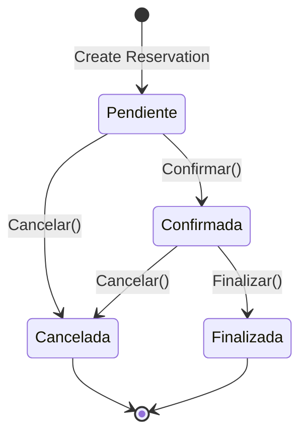

The `Reserva` entity is the **aggregate root** for the reservation domain. It orchestrates reservations, managing rooms, additional services, pricing snapshots, and state transitions with comprehensive business rule enforcement.

## Overview

`Reserva` encapsulates all reservation logic including date management, room assignments, service additions, cost calculations, and state transitions. It enforces complex business rules through guard clauses and domain policies.

**Namespace:** `SGRH.Domain.Entities.Reservas`

**Source:** `~/workspace/source/SGRH.Domain/Entities/Reservas/Reserva.cs`

## Properties

<ResponseField name="ReservaId" type="int" required>
  Unique identifier for the reservation (primary key).
</ResponseField>

<ResponseField name="ClienteId" type="int" required>
  Reference to the customer making the reservation.
</ResponseField>

<ResponseField name="EstadoReserva" type="EstadoReserva" required>
  Current state of the reservation: `Pendiente`, `Confirmada`, `Cancelada`, or `Finalizada`.
</ResponseField>

<ResponseField name="FechaReserva" type="DateTime" required>
  Timestamp when the reservation was created (UTC).
</ResponseField>

<ResponseField name="FechaEntrada" type="DateTime" required>
  Check-in date for the reservation.
</ResponseField>

<ResponseField name="FechaSalida" type="DateTime" required>
  Check-out date for the reservation.
</ResponseField>

<ResponseField name="CostoTotal" type="decimal" computed>
  **Calculated property**: Sum of all room rates plus service costs.
  
  ```csharp
  CostoTotal = _habitaciones.Sum(h => h.TarifaAplicada) + _servicios.Sum(s => s.SubTotal)
  ```
</ResponseField>

<ResponseField name="Habitaciones" type="IReadOnlyCollection<DetalleReserva>" required>
  Read-only collection of rooms assigned to this reservation.
</ResponseField>

<ResponseField name="Servicios" type="IReadOnlyCollection<ReservaServicioAdicional>" required>
  Read-only collection of additional services for this reservation.
</ResponseField>

## Constructor

```csharp
public Reserva(int clienteId, DateTime fechaEntrada, DateTime fechaSalida)
```

Creates a new reservation in `Pendiente` state.

### Parameters

- **clienteId**: Valid customer ID (must be > 0)
- **fechaEntrada**: Check-in date
- **fechaSalida**: Check-out date (must be after check-in)

### Initial State

- `EstadoReserva` = `Pendiente`
- `FechaReserva` = `DateTime.UtcNow`
- Empty room and service collections

### Example

```csharp
var reserva = new Reserva(
    clienteId: 123,
    fechaEntrada: new DateTime(2026, 06, 01),
    fechaSalida: new DateTime(2026, 06, 05)
);
```

## State Management

### Estado Reserva Lifecycle



### State Transition Methods

<Accordion title="Confirmar()">
  ```csharp
  public void Confirmar()
  ```
  
  Confirms a pending reservation.
  
  **Preconditions:**
  - Must be in `Pendiente` state
  - Must have at least one room assigned
  
  **Throws:**
  - `BusinessRuleViolationException` if state is not `Pendiente`
  - `BusinessRuleViolationException` if no rooms are assigned
</Accordion>

<Accordion title="Cancelar()">
  ```csharp
  public void Cancelar()
  ```
  
  Cancels the reservation.
  
  **Preconditions:**
  - Cannot be `Finalizada`
  - Cannot already be `Cancelada`
  
  **Throws:**
  - `BusinessRuleViolationException` if already finalized or canceled
</Accordion>

<Accordion title="Finalizar()">
  ```csharp
  public void Finalizar()
  ```
  
  Finalizes a confirmed reservation (typically at check-out).
  
  **Preconditions:**
  - Must be in `Confirmada` state
  
  **Throws:**
  - `BusinessRuleViolationException` if not confirmed
</Accordion>

## Date Management

### CambiarFechas

```csharp
public void CambiarFechas(
    DateTime nuevaEntrada,
    DateTime nuevaSalida,
    IReservaDomainPolicy policy)
```

Changes reservation dates with comprehensive validation.

**Policy Validations:**
- Ensures all assigned rooms are available for new dates
- Checks no rooms are in maintenance during new period
- Validates services are available in the new season
- Recalculates pricing snapshots

**Example:**

```csharp
reserva.CambiarFechas(
    nuevaEntrada: new DateTime(2026, 06, 10),
    nuevaSalida: new DateTime(2026, 06, 15),
    policy: reservaDomainPolicy
);
```

## Room Management

### AgregarHabitacion

```csharp
public void AgregarHabitacion(int habitacionId, IReservaDomainPolicy policy)
```

Adds a room to the reservation.

**Validations:**
- Reservation must be editable (not confirmed/canceled/finalized)
- Room not already in reservation
- Room is available for the date range
- Room is not in maintenance
- Captures current rate as snapshot

**Example:**

```csharp
reserva.AgregarHabitacion(habitacionId: 101, policy: domainPolicy);
```

### QuitarHabitacion

```csharp
public void QuitarHabitacion(int habitacionId, IReservaDomainPolicy policy)
```

Removes a room from the reservation.

**Note:** Automatically recalculates service pricing if services exist.

## Service Management

### AgregarServicio

```csharp
public void AgregarServicio(
    int servicioAdicionalId,
    int cantidad,
    IReservaDomainPolicy policy)
```

Adds an additional service to the reservation.

**Business Rules:**
- At least one room must be assigned first
- Service not already in reservation (use `CambiarCantidadServicio` to update)
- Service must be available in the current season
- Price snapshot captured at time of addition

**Example:**

```csharp
reserva.AgregarServicio(
    servicioAdicionalId: 5,
    cantidad: 2,
    policy: domainPolicy
);
```

### CambiarCantidadServicio

```csharp
public void CambiarCantidadServicio(int servicioAdicionalId, int nuevaCantidad)
```

Updates the quantity of an existing service.

### QuitarServicio

```csharp
public void QuitarServicio(int servicioAdicionalId)
```

Removes a service from the reservation.

## Business Rules

<Accordion title="Editability Rules">
  The `EnsureEditable()` internal guard prevents modifications when:
  
  - State is `Confirmada` (confirmed reservations are immutable)
  - State is `Cancelada` (canceled reservations cannot be changed)
  - State is `Finalizada` (finalized reservations are closed)
  
  Only `Pendiente` reservations can be modified.
</Accordion>

<Accordion title="Service Prerequisites">
  Services can only be added to reservations that have at least one room assigned. This ensures services are properly priced based on room categories.
</Accordion>

<Accordion title="Pricing Snapshots">
  When rooms or services are added, current prices are captured as snapshots:
  
  - Room rates are stored in `DetalleReserva.TarifaAplicada`
  - Service prices stored in `ReservaServicioAdicional.PrecioUnitarioAplicado`
  
  These snapshots are recalculated when dates change (only for `Pendiente` reservations).
</Accordion>

<Accordion title="Duplicate Prevention">
  The aggregate prevents duplicates:
  
  - Cannot add the same room twice (throws `ConflictException`)
  - Cannot add the same service twice (throws `ConflictException`)
</Accordion>

## Domain Policy Integration

The `Reserva` aggregate depends on `IReservaDomainPolicy` for:

- Room availability checks
- Maintenance schedule validation
- Season determination
- Rate calculation
- Service availability validation
- Service pricing (max price by room category)

See [Reservation Policies](/domain/reservation-policies) for details.

## Child Entities

### DetalleReserva

Represents a room assignment within the reservation.

```csharp
public sealed class DetalleReserva
{
    public int DetalleReservaId { get; private set; }
    public int ReservaId { get; private set; }
    public int HabitacionId { get; private set; }
    public decimal TarifaAplicada { get; private set; }
}
```

### ReservaServicioAdicional

Represents an additional service within the reservation.

```csharp
public sealed class ReservaServicioAdicional
{
    public int ReservaServicioAdicionalId { get; private set; }
    public int ReservaId { get; private set; }
    public int ServicioAdicionalId { get; private set; }
    public int Cantidad { get; private set; }
    public decimal PrecioUnitarioAplicado { get; private set; }
    public decimal SubTotal => Cantidad * PrecioUnitarioAplicado;
}
```

## Related Documentation

- [Cliente](/domain/cliente) - Customer entity
- [Habitacion](/domain/habitacion) - Room entity
- [ServicioAdicional](/domain/servicio-adicional) - Additional services
- [Reservation Policies](/domain/reservation-policies) - Business rules and policies
- [Validation Guards](/domain/validation-guards) - Validation mechanisms
